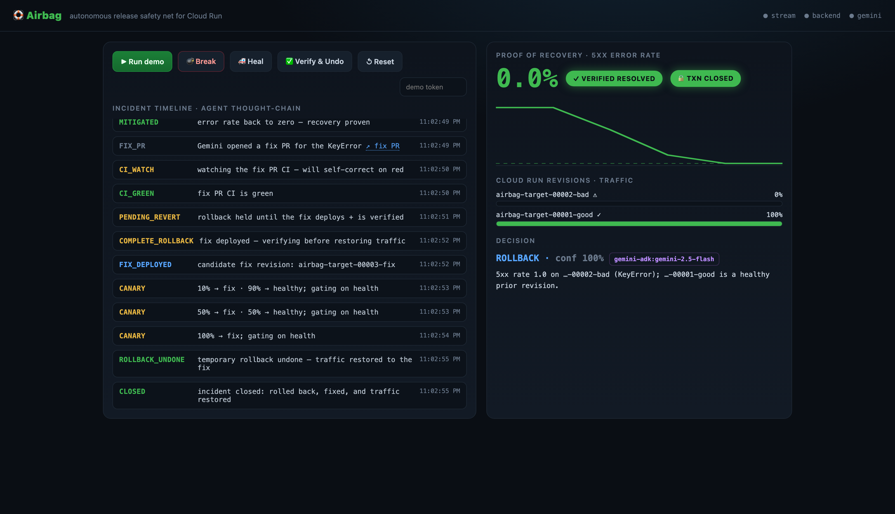

# Airbag — autonomous release airbag for Cloud Run

> Detects a bad Cloud Run deploy **even hours after it shipped**, instantly rolls traffic back to the last healthy revision, **proves recovery** via Cloud Monitoring/Logging, has Gemini open a real fix PR through CI/CD — then, once the fix deploys, **verifies it and undoes the temporary rollback** to close the loop (compensating back to safety if the fix fails). Triggered by the fix-PR's CI or one click in the dashboard.

Built for the **DevOps × AI Agent Hackathon 2026** (Google Cloud Japan / Findy). Stack: **Gemini + ADK + Cloud Run** (required), FastAPI, Cloud Monitoring/Logging, GitHub App + Actions.

## Why this exists
Monitoring tools only *alert*. Coding agents (Jules/Devin) only *write code* offline. Auto-rollback tools (Argo/Harness/LaunchDarkly) only work **inside the deploy/canary window**. **Google's own Gemini Cloud Assist is officially advisory** ("don't modify… human-in-the-loop required"). Nobody closes this exact loop:

```
independent prod alert (even out-of-window)
  → auto rollback Cloud Run traffic to last-good revision   (deterministic, reversible — STOP THE BLEEDING)  ✅ live
  → prove error-rate == 0 via Monitoring/Logging + synthetic probe   (PROOF OF RECOVERY)                    ✅ live
  → Gemini/ADK open a fix PR → real GitHub Actions CI         (PERMANENT FIX)                                ✅ live
  → on deploy + verified, undo the temporary rollback (CLOSE THE TRANSACTION)                                ✅ verify + undo + compensate
```
All four steps run on live Cloud Run. The close-the-transaction step verifies the deployed revision **is** the fix (matches the CI-reported revision/sha, or a post-rollback healthy candidate) before restoring traffic, and **compensates** back to the safe revision if the fix fails — triggered by the fix-PR's CI (`/internal/complete-rollback`) or the dashboard's **Verify & Undo** button. *(The CI path is **fully unattended** — GitHub Actions authenticates to GCP keylessly via Workload Identity Federation, deploys the fix, and calls Airbag to verify + restore, no human; verified live. Setup: [`infra/wif-setup.sh`](infra/wif-setup.sh).)*

**Design rule:** a deterministic state machine executes production actions; **Gemini only diagnoses and emits a structured decision** — the LLM never freely touches prod.

## Architecture (target)
```
Cloud Monitoring alert ─webhook(token)→ /alerts  (Cloud Run: airbag-agent, FastAPI)
                                            │ 202 then async
                            ┌───────────────┴───────────────┐
                            │  ADK SequentialAgent                  │
                            │  triage → analyze(Wilson CI) → decide │
                            │    → autonomy gate → rollback         │
                            │    → verify(loop) → fix-PR            │
                            └───────────────┬───────────────────────┘
   tools: Cloud Run Admin (run_v2) · Cloud Monitoring/Logging · GitHub App
   state: durable Firestore store (AIRBAG_STATE=memory|firestore) — survives container recycles
          (single-instance: the SSE bus is in-process)   secrets: Secret Manager
                                            │
   target demo app (Cloud Run) ←rollback traffic / ←fix deploy
```

## Repo layout
| Path | What |
|---|---|
| `agent/` | The self-heal agent — FastAPI webhook + ADK 1.x state machine |
| `target-app/` | The "delay-bomb" demo target deployed to Cloud Run (injectable faults) |
| `infra/` | `gcloud` setup: enable APIs, service account + min IAM, alert policy, webhook channel |
| `agent/static/dashboard.html` | live glassbox dashboard — SSE thought-chain, proof-of-recovery curve, Break/Heal/Verify&Undo, incident-report link |
| `docs/` | `PLAN.md` (roadmap + minimal slice), `ARCHITECTURE.md` |
| `.github/workflows/` | CI |

## Status — 🟢 LIVE on Google Cloud Run
The **deployed agent autonomously heals the deployed target** on real Cloud Run, decided by real Gemini. Verified end-to-end: bad revision serving 500s (a planted `KeyError` on `/api/orders`) → agent detects → Gemini decides `ROLLBACK` (conf 1.0) → real traffic shifts to the healthy revision → error rate proven `0%`. The slow path then opens a fix PR for **that same `KeyError`** — rolled back *and* root-cause fixed.

| | URL |
|---|---|
| **Agent + dashboard** | https://airbag-agent-946577240607.asia-northeast1.run.app |
| **Target (demo app)** | https://airbag-target-946577240607.asia-northeast1.run.app |


*The glassbox dashboard: the agent's thought-chain (detect → **ADK triage→decide** → rollback → verify → fix-PR), the 5xx error-rate dropping to 0 with the **✓ VERIFIED RESOLVED** gate, and the structured `gemini-adk` decision.*

**Fully autonomous:** a real **Cloud Monitoring 5xx alert** fires on its own and triggers the heal with **no human in the loop** (verified — target rolled back ~3 min after the alert, triggered by Cloud Monitoring incident, not a button). Wire it with `./infra/alert-setup.sh`.

**Dual-path heal:** after the rollback stops the bleeding, the slow path runs an **agentic fix pipeline** — Gemini reads the *real stack trace* (root-cause analysis), patches the culprit file, and **authors a regression test that's sandbox-verified to fail on the bug and pass on the fix** *before* opening a PR that commits **both the fix and the test** (a self-proving PR — see [open PRs](https://github.com/JasonYeYuhe/cloud-run-airbag/pulls)), which passes `on: push` CI. Runs **on the deployed agent** during a live heal (fine-grained token in Secret Manager); idempotent — reuses an open `airbag/fix` PR rather than spamming.

**Cloud demo:** `./scripts/gcp-demo.sh` (breaks the target), then either wait for the alert, or open the agent URL and click **🚑 Heal** for the instant path.
**Reproduce the deploy from scratch:** `gcloud auth login` once, then `PROJECT=<id> ./deploy.sh`.

## v2 — production-grade autonomy (live)
Four upgrades take Airbag from "impressive demo" toward "a thing a team would actually run." Each
was built against an adversarial review (Gemini 3.1 Pro + 3.5 Flash, and/or a multi-agent review
workflow) and verified on live Cloud Run:

| Upgrade | What it does | Where |
|---|---|---|
| **Statistical decision gate** | The rollback trigger is a **Wilson confidence-interval** verdict (`FAIL`/`PASS`/`INCONCLUSIVE`), not a static `5xx ≥ 5%`. `PASS`→withhold, `INCONCLUSIVE`→escalate (don't auto-act on weak evidence), `FAIL`→proceed. A low-traffic 4/4 outage still fires; a single blip never does. | [`analyzer.py`](agent/autosre/analyzer.py) |
| **Durable state** | Pending reverts, incidents, and webhook dedup live in **Firestore** (`AIRBAG_STATE=firestore`), behind one atomic `transact`. Self-healing **lease** lock (a crashed heal can't lock a revert forever); survives container recycles. *(Single-instance today — the in-process SSE bus blocks multi-instance; Pub/Sub is the roadmap.)* | [`state_store.py`](agent/autosre/state_store.py) |
| **Graduated autonomy** | Per-service trust levels enforced **deterministically**: `L0` observe · `L1` approve-before-rollback · `L2` auto-rollback + approve-the-fix-PR · `L3` full. Durable approval gate (`/internal/approve`, dashboard Approve/Deny); advisory promotion + automatic demotion on a failed heal. | [`autonomy.py`](agent/autosre/autonomy.py) |
| **Learned baseline + memory** | The analyzer's baseline is **learned per service** (EMA of steady-state healthy samples), not hardcoded. Cross-incident memory tracks failures + flags a **recurring** incident ("the fix isn't holding"). | [`memory.py`](agent/autosre/memory.py) |

The deterministic-core / LLM-advisory rule still holds throughout: Gemini decides, the state machine
(now with a statistical gate **and** an autonomy gate) validates and acts.

It also runs fully **locally with no GCP** (see below). See [docs/PLAN.md](docs/PLAN.md) and [docs/DEMO.md](docs/DEMO.md).

## Run the live demo (no GCP, ~1 min)
```bash
./run-local.sh            # boots target-app (:8081) + agent+dashboard (:8080)
# open http://localhost:8080  →  click "▶ Run demo"
```
You'll watch the agent detect the injected fault, decide, roll Cloud Run traffic back to
the healthy revision, and prove the 5xx rate hits zero — streamed live as a thought-chain.

## Execution backends (`AIRBAG_BACKEND`)
| value | what it does | needs |
|---|---|---|
| `mock` | in-memory (CI/tests) | nothing |
| `local` | **real HTTP** against the local target-app; rollback = shift traffic off the faulty revision | nothing (default for the demo) |
| `gcp` | **real Cloud Run** via `run_v2` + Cloud Monitoring | `gcloud auth` + billing-enabled project |

**Gemini:** set `GEMINI_API_KEY` (AI Studio) to use a real Gemini structured decision;
without it the agent falls back to a deterministic decision so the demo always runs.

## License
MIT © 2026 Jason Ye
