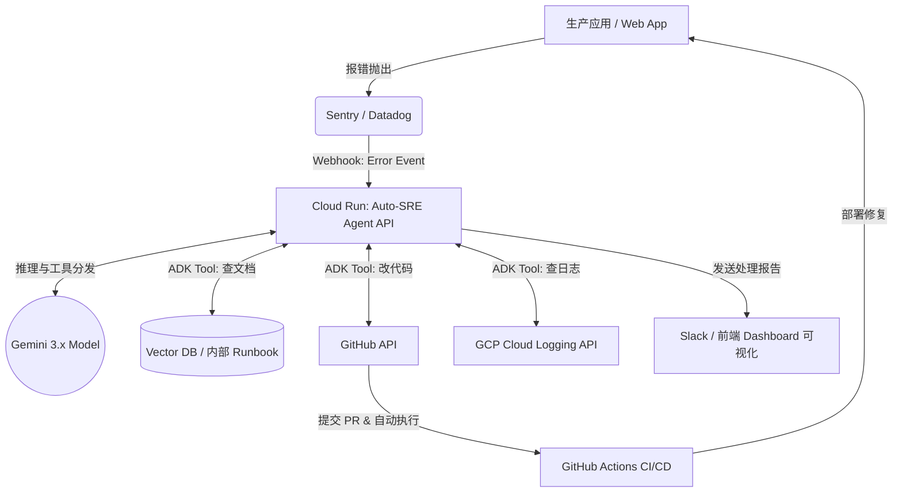

这是一份专为你的技术栈和时间线（剩 2 周）量身定制的 **DevOps × AI Agent Hackathon 2026** 参赛调研与执行报告。

### 1. 提交物清单（推断的 Deliverables）
为了在「つくる、まわす、とどける」三方面拿满分，你需要准备以下提交物（按重要度排序）：
1. **可交互的 Demo 视频（最重要，3-5 分钟）**：评委没时间自己跑所有项目。视频必须真实展示：触发警报/事件 -> Agent **自动接管** -> Agent 调用工具解决问题 -> 恢复绿灯的完整闭环。
2. **部署好的 Web 界面 / 仪表盘 URL**：托管在 Cloud Run 上。即使 Agent 是后端的，也需要一个前端（Next.js/React）来可视化 Agent 的思考过程（Thought Process）、调用的工具、执行的日志。
3. **架构与设计文档（重点考察「必要性与自治设计」）**：
   - 核心系统图（数据如何流经 GitHub/监控 -> Cloud Run -> Gemini ADK）。
   - **自治状态机说明**：明确说明 Agent 在遇到不同情况时，如何自主决策（而不只是大模型生硬的一问一答）。
4. **GitHub 开源仓库**：包含完整的 IaC（如果是 GCP Terraform/Pulumi）或部署配置（`cloudbuild.yaml` 或 GitHub Actions workflow），证明「まわす」（CI/CD 闭环）真实存在。

---

### 2. 具体项目点子（按 "2周可行性 × 契合度" 排序）

#### 💡 #1：Auto-SRE 故障自愈专家 (Agentic SRE Responder) 
- **一句话定位**：当生产环境或流水线报错时，自动诊断、查阅文档、并执行回滚或热修复的自治 SRE 机器人。
- **Agent 自治做什么**：不只是“报警”，而是接收 Sentry/Datadog Webhook，**自主拉取**最新错误日志，**自主查阅**对应的内部 Runbook（通过 RAG），决定是“安全回滚”还是“生成修复代码并提 PR”。
- **使用组件**：Gemini 3.x (高阶推理), Gemini ADK (工具调用: GitHub API, Sentry API), Cloud Run (承载 Agent Webhook)。
- **「まわす」(CI/CD)**：Agent 本身通过 GitHub Actions 部署；当它生成修复 PR 并合并后，触发应用的自动 CI/CD。
- **「とどける」(交付)**：作为微服务部署在 Cloud Run 上，高可用，随时响应警报。
- **评委青睐点**：直击 DevOps 痛点，完全展示了“必须自治”的理由（半夜宕机需要秒级响应，人类来不及）。
- **可行性/MVP**：**高**。2周内可硬编码特定的错误类型（如 NullPointer 或 内存溢出）演示全流程。

#### 💡 #2：云成本刺客 (Autonomous FinOps Agent)
- **一句话定位**：自动寻找、关停闲置资源，并自动生成 IaC 修改 PR 的省钱 Agent。
- **Agent 自治做什么**：定时轮询 Google Cloud Billing 和监控指标。如果发现闲置的 Cloud Run 实例、无流量的 DB，它不只是发报告，而是**直接调用 GCP API 缩容**，并向代码库提交 Terraform/IaC 的降配 PR。
- **使用组件**：Gemini 3.x, Cloud Scheduler (触发), Cloud Functions/Run, GCP Billing/Compute API。
- **「まわす」(CI/CD)**：Agent 修改的 IaC 代码触发 CI 测试，确保降配不会导致语法或依赖错误。
- **「とどける」(交付)**：通过 Cloud Run 定时任务（Job）无缝部署交付。
- **评委青睐点**：商业价值极高，结合了云原生运维，企业非常愿意买单。
- **可行性/MVP**：**高**。MVP 只需针对一种资源（如忘记删除的测试环境 Cloud Run 服务）做自动清理。

#### 💡 #3：CI/CD 绿灯侠 (Pipeline Auto-Healer)
- **一句话定位**：自动修复构建失败和测试用例不通过的 CI/CD 守护者。
- **Agent 自治做什么**：监听 GitHub Actions 失败事件，自主阅读失败日志，克隆代码在沙盒中尝试修复，跑通测试后，自动把修复代码 push 上去。
- **使用组件**：Gemini ADK (用于沙盒代码执行和沙盒验证), GitHub Webhooks, Cloud Run。
- **「まわす」(CI/CD)**：完美融入现有的 CI/CD 流程中，属于 "CI/CD for CI/CD"。
- **「とどける」(交付)**：Agent 逻辑通过 Cloud Build 打包交付。
- **评委青睐点**：“自己跑，自己修，自己交付”，极度贴合 Hackathon 主题。
- **可行性/MVP**：**中高**。2周内可以只针对特定语言（如 TypeScript/Node 的 Jest 测试失败或 Lint 报错）做精准修复。

#### 💡 #4：合规与安全漏洞自动封堵者 (SecOps Patcher Agent)
- **一句话定位**：不仅扫描漏洞，还自动改代码、发包、测试的 SecOps Agent。
- **Agent 自治做什么**：收到 Dependabot 或 Snyk 的高危漏洞通知后，自主拉取代码，修改 `package.json` 并解决破坏性更新（Breaking Changes）导致的代码报错，测试通过后自动合并。
- **使用组件**：Gemini Enterprise Agent Platform (处理复杂的代码逻辑推理), Cloud Run。
- **评委青睐点**：比传统的 Dependabot 强在“自动解决 breaking changes”。
- **可行性/MVP**：**中**。依赖树可能很复杂，MVP 需限定在一个小型 React/Next 项目。

#### 💡 #5：Chaos Agent (混沌工程自治测试员)
- **一句话定位**：在预发环境像“猴子”一样自动搞破坏，并自动出具系统韧性报告的 Agent。
- **Agent 自治做什么**：自主决定关闭哪些服务、注入什么网络延迟，然后观察监控系统。如果发现系统能扛住，就继续加码；扛不住，自动终止破坏并记录弱点。
- **使用组件**：GCP API, Datadog API, Gemini 3.x。
- **评委青睐点**：概念非常酷，展现了高阶的自治决策逻辑。
- **可行性/MVP**：**中低**。2周内实现安全的“破坏”较难，容易做成纯脚本。

#### 💡 #6：环境幽灵 (Ephemeral Environment Manager)
- **一句话定位**：让每一个 PR 自动拥有全套云原生环境的调度 Agent。
- **Agent 自治做什么**：看懂 PR 的意图，自主向 GCP 申请恰到好处的资源（数据库、Redis、Cloud Run），注入假数据，把链接贴给 Reviewer，合并后自动销毁。
- **评委青睐点**：解决微服务本地难以测试的痛点。
- **可行性/MVP**：**低**。涉及太多基础设施脚手架工作，2周容易干不完。

---

### 3. 最推荐的点子：Auto-SRE 故障自愈专家

**为什么选它**：最能体现大模型 Agent 的“推理+执行”能力，结合了你熟练的 TypeScript/Node/Sentry/GCP 栈，2周完全做得出惊艳的 Demo。

#### 核心架构图 (Data Flow)

#### 2 周冲刺里程碑 (MVP 计划)
- **Day 1-2 (基建与 Demo 靶机)**：
  - 用 Next.js 写一个极其容易抛错的“靶机”应用（比如点击按钮就抛出一个前端 API 错误，或后端 Null 处理错误）。
  - 配置靶机的 GitHub Actions CI/CD，部署到 Cloud Run。接入 Sentry 捕获错误。
- **Day 3-6 (Agent 核心大脑构建)**：
  - 使用 TS/Node 初始化 Agent 服务，部署到 Cloud Run。
  - 使用 Gemini ADK 定义 Agent 工具（Tools）：`get_sentry_trace()`, `read_github_file()`, `create_github_pr()`。
  - 编写自治 Prompt：“你是一个 SRE Agent。收到 Webhook 后，你必须弄清楚错误原因，找到对应的源码，修改它，并提交 PR。”
- **Day 7-9 (闭环与打通「まわす」)**：
  - 测试联调：点击靶机按钮 -> Sentry 发出 Webhook -> Agent 拉取代码 -> Agent 用 Gemini 3.x 生成 Fix -> Agent 提交 PR。
  - 配置 CI 测试 PR。
- **Day 10-12 (界面可视化「とどける」)**：
  - 开发一个酷炫的深色模式前端 Dashboard（你的强项，Vercel 部署即可）。实时通过 WebSocket 或轮询展示 Agent 的思考过程：“收到警报 -> 正在分析堆栈 -> 发现 `utils.ts` 第 45 行有 Bug -> 正在生成补丁 -> PR #12 已提交”。（**这一步是拿奖的关键，评委需要直观看到 Agent 在干嘛**）。
- **Day 13-14 (打磨视频与文档)**：
  - 录屏一气呵成：制造故障 -> 屏幕一侧是前台报错，一侧是 Agent Dashboard 疯狂跳动思考 -> GitHub 出现 PR -> 自动合并 -> 故障恢复。完成 PPT 与架构图。

---

### 4. 制胜策略与常见踩坑

#### 如何最大化拿分
1. **死磕「必要性与自治执行」**：评委最讨厌“只是套了个壳的 ChatGPT”。你的 Agent 必须能在**无人干预**的情况下执行 `git commit` 或调用 GCP API。在架构文档中重点描述你的 Agent 是如何处理失败重试的（例如：Agent 提交的代码 CI 没跑过，Agent 应该能看到 CI 日志，并**自动发起第二次尝试**，这就是终极自治）。
2. **可视化 Thought Process**：Agent 在后台默默把事办了，对用户是好事，对黑客松是灾难。**一定要让 Agent “大声思考”**。将 Agent 调用的每一个 ADK Tool、每一次大模型返回的中间结果，打印在你的 Dashboard 上。
3. **原生结合 Google Cloud**：既然 Google Cloud 协赞，一定要重度使用其服务。不仅仅是用 Gemini API，你的 Agent 跑在 Cloud Run，用 Cloud Logging 查日志，用 Secret Manager 存 GitHub Token。
4. **Agent 的「まわす」**：你的 Agent 自身的代码也需要有 CI/CD。向评委展示你使用 GitHub Actions 实现了 Agent 的持续部署，证明你懂 DevOps。

#### 常见踩坑
- **坑 1：坑在基建上**。花了一周半搭建 Kubernetes，导致 Agent 没写完。**对策**：全部用 Serverless（Cloud Run, Vercel, Supabase），零运维，把时间全花在 Agent 逻辑上。
- **坑 2：大模型幻觉导致 Demo 翻车**。**对策**：在黑客松中，给大模型的 Prompt 要极其具体，甚至利用 System Prompt 将其行为“收束”在特定的 2-3 个预设剧本内。不要做开放域的 Agent，做垂直领域的“偏执狂” Agent。

### 5. 风险与备选 (Plan B)
- **风险 1：Gemini 3.x 频繁给出错误的代码补丁，导致 CI 无限循环。**
  - **Plan B 降级**：如果 Agent 写代码能力达不到要求，降级为 **"Auto-Rollback & Runbook Agent"**。即 Agent 发现错误后，不改代码，而是直接调用 API 触发上一版本的**自动回滚**，然后将总结好的排错报告和可能的修复建议发到 Slack。这依然是一个完美的 DevOps 闭环，且 100% 可行。
- **风险 2：Sentry / 监控系统 Webhook 延迟太高，Demo 等不及。**
  - **对策**：在 Dashboard 上做个后门按钮，一键手动触发向 Agent 发送模拟的 Webhook Payload，保证答辩时随叫随到。
