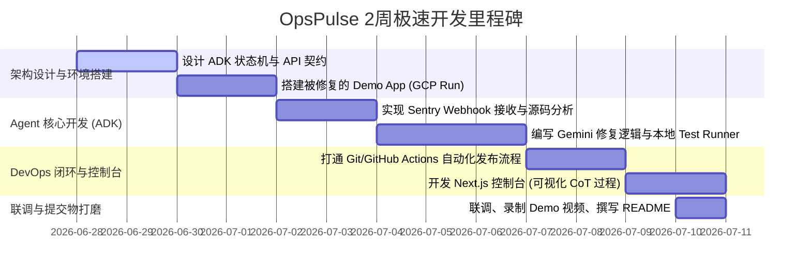

# DevOps × AI Agent Hackathon 2026 参赛调研与执行方案

这份报告针对 **DevOps × AI Agent Hackathon 2026**（Google Cloud Japan 协赞 / Findy 主办）进行深度拆解，结合您的技术栈（TS/Node, React, Supabase, Cloud Run, Gemini, GitHub Actions）以及“つくる (创造)、まわす (运行)、とどける (交付)”三大评审重点，为您定制一份 2 周内高可行性的参赛方案。

---

## 1. 提交物清单与规格建议（Deliverables Checklist）

距离 7/10 提交截止仅剩约 2 周，交付物必须精准对齐评审的关注点。以下是建议的提交清单及规格：

| 交付物 | 建议规格与核心展示内容 | 评审重点映射 |
| :--- | :--- | :--- |
| **GitHub 仓库** | <ul><li>包含 Agent 源码及被测试/被运维的目标 App 源码（推荐单仓 Monorepo）。</li><li>包含完整的 GitHub Actions 工作流文件。</li><li>`README.md` 包含清晰的自治逻辑流图（Mermaid）和运行命令。</li></ul> | **まわす** (CI/CD 闭环) <br> **つくる** (自治设计) |
| **部署 URL** | <ul><li>**Agent 控制台**：基于 Next.js + Tailwind 部署在 Vercel/Cloud Run，展示 Agent 的自治执行状态、决策日志和追踪（Trace）。</li><li>**目标演示 App**：部署在 Google Cloud Run，作为 Agent 运维和自动修复的对象。</li></ul> | **とどける** (GCP 部署) <br> **つくる** (真交付) |
| **Demo 视频** <br>(最大 3 分钟) | <ul><li>**0:00-0:30**：痛点引入与架构（双 Agent/Loop 概念）。</li><li>**0:30-2:00**：**核心演示**（手动制造一个生产环境报错 $\rightarrow$ 触发 Webhook $\rightarrow$ Agent 启动分析并提出 Fix $\rightarrow$ CI/CD 自动构建部署 $\rightarrow$ 线上验证通过）。</li><li>**2:00-3:00**：异常流程处理展示（如修复失败自动 Rollback）与技术栈展示。</li></ul> | **评审一字千金** <br> (直观展示自治) |
| **系统架构文档** <br>(集成在 GitHub/控制台) | <ul><li>详细列出 Gemini ADK 节点设计（State, Tools, Transition Rules）。</li><li>标明 Google Cloud 服务集成点（Cloud Run, Cloud Build, Cloud Logging）。</li></ul> | **つくる** (系统自治设计) |
| **演示文稿 (Pitch Deck)** | <ul><li>不超过 8 页的 PDF。</li><li>重点阐述：**为什么必须是 Autonomous Agent 解决，而不是传统脚本/规则引擎**；DevOps 闭环的可靠性设计。</li></ul> | **评委特别奖/综合评审** |

---

## 2. 6 个具体项目点子排序（按 2 周可行性 × 契合评审重点）

以下点子专注于 **DevOps 领域**，剔除泛泛的聊天机器人，确保 Agent 具备“自治执行（Write/Deploy/Rollback/Monitor）”的核心特征。

### 📊 推荐指数与排序总览
1. **🥇 OpsPulse: 生产环境 Sentry 告警自愈与闭环验证 Agent** (可行性：极高)
2. **🥈 PerfTuner: Cloud Run 自动 FinOps 与性能负载压测微调 Agent** (可行性：高)
3. **🥉 SafeSchema: 数据库 Migration 自动安全演进与回滚验证 Agent** (可行性：高)
4. **4️⃣ Playwright Healer: E2E 测试自愈与代码库提交 Agent** (可行性：中)
5. **5️⃣ SecGuard: 依赖漏洞自动重构与 CI 修复验证 Agent** (可行性：中)
6. **6️⃣ ChaosBot: 混沌工程自动注入与恢复观测 Agent** (可行性：中)

---

### 点子 1：OpsPulse - 生产环境 Sentry 告警自愈与闭环验证 Agent（首选）
* **一句话定位**：一个与 Sentry 和 GitHub 深度集成的自愈运维 Agent，能够自主诊断线上报错、编写修复代码、通过 CI/CD 发布并监控回流指标以确认自愈。
* **Agent 自治行为**：
  1. 监听到 Sentry Webhook 报错（如 `TypeError: Cannot read properties of undefined`）。
  2. 自主调用 GitHub API 拉取对应版本的代码，定位报错源文件。
  3. 使用 Gemini 3.x 诊断并编写 Fix 补丁，同时编写一个针对该 Bug 的单元/集成测试。
  4. 自动创建 GitHub Branch 并提交 PR，触发 GitHub Actions 跑通测试。
  5. 自动 Merge（或模拟 Lead DevOps 一键审批）并部署到 Cloud Run。
  6. 自动监控 Cloud Run 之后的 Live metrics，若 5 分钟内错误率清零则宣布任务完成；若出现新报错则自动执行 Git Rollback。
* **Google Cloud / ADK 组件**：
  * **Gemini Enterprise Agent Platform & ADK**：用于构建状态机（诊断状态 $\rightarrow$ 修复状态 $\rightarrow$ 验证状态 $\rightarrow$ 回滚/完成状态）。
  * **Google Cloud Run**：部署 Agent 服务与目标 App。
  * **Cloud Logging & Monitoring**：Agent 获取发布后健康指标的数据源。
* **「まわす」(循环迭代)**：形成“**监控报错 $\rightarrow$ 自动编写代码 $\rightarrow$ CI/CD 验证与部署 $\rightarrow$ 生产环境指标监控 $\rightarrow$ 反馈确认/回滚**”的绝对闭环。
* **「とどける」(交付)**：Agent 本身和目标 App 均运行在 Cloud Run 上，Agent 提供一个可视化 Dashboard（Next.js）让用户实时观察它的诊断思路链（Chain-of-Thought）和部署状态。
* **评委青睐点**：极其契合「つくる、まわす、とどける」闭环。它不是静态的问答，而是直接操作了生产代码仓库和部署流水线，将 AI 引入到了 CI/CD 的核心回路中。
* **2 周内可行性与 MVP 范围**：**极高**。
  * *MVP 范围*：只针对一类特定错误（如 API 请求返回未判空导致的 Runtime Error）。Agent 定位到文件，用 Gemini 修改该行，跑 npm test，提交 GitHub PR，通过 Mock Webhook 触发。

---

### 点子 2：PerfTuner - Cloud Run 自动 FinOps 与性能负载压测微调 Agent
* **一句话定位**：一个持续优化 Cloud Run 配置（CPU、内存、并发度、冷启动）的 FinOps 助手，通过自动化压测来寻找成本与性能的最优解。
* **Agent 自治行为**：
  1. 周期性拉取 Cloud Monitoring 数据，发现某个 Cloud Run 实例并发低且 CPU 利用率常年低于 10%（资源浪费），或者经常发生 OOM。
  2. 自动在 Staging 环境复制一份该实例，调用压测工具（如 Locust/k6）发起模拟流量。
  3. 尝试多种配置组合（如 512MB/1CPU vs 1GB/2CPU，不同的最小实例数限制），记录 Latency 95line 和成本开销。
  4. 运用多目标优化算法（Gemini 决策），生成最佳的 `service.yaml`。
  5. 自动向 Infrastructure 仓提交 Pull Request，修改 Terraform 或 gcloud 部署脚本。
* **Google Cloud / ADK 组件**：
  * **Cloud Monitoring API**：读取历史指标。
  * **Cloud Build & Cloud Run**：动态创建临时测试环境，执行压测。
  * **ADK**：决策引擎，负责评估压测结果并调节参数。
* **「まわす」**：优化配置的 GitOps 迭代。Agent 自动修改 IaC 代码并验证，避免了人工猜测参数。
* **「とどける」**：交付一键式 Cloud Run 性能调优报告，并能直接改变 GCP 上的真实基础设施。
* **评委青睐点**：高价值的 FinOps 场景，展示了 Agent 对 GCP 原生服务的深度控制力。
* **2 周内可行性与 MVP 范围**：**高**。
  * *MVP 范围*：在 GitHub Actions 里运行 k6 压测，Agent 根据压测输出的 JSON，判断是否需要微调 CPU/Memory，然后修改 repo 里的 `wrangler.toml` 或 `service.yaml` 并重新部署。

---

### 点子 3：SafeSchema - DB Migration 安全演进与回滚验证 Agent
* **一句话定位**：一个专注于数据库变更安全的 DBOps Agent，自动审查 SQL 迁移文件，在沙盒中试运行、评估锁表风险，并编写防灾回滚脚本。
* **Agent 自治行为**：
  1. 开发者提交包含 SQL Migration 的 PR。
  2. Agent 自动拦截，在 Supabase/Cloud SQL 沙盒实例中拉起数据库备份。
  3. 执行 Migration SQL，并注入模拟的千万级并发读写流量，分析 `EXPLAIN ANALYZE` 和 `pg_locks`，评估是否会导致长时间锁表或全表扫描。
  4. 自主利用 Gemini 生成对应的**反向回滚 SQL (Rollback/Down Migration)**。
  5. 在沙盒中执行回滚，验证数据一致性是否受损。
  6. 回贴 PR，给出安全评估报告，若验证通过则自动 Approve 并 Merge PR。
* **Google Cloud / ADK 组件**：
  * **Cloud SQL (PostgreSQL)** / **Supabase**：提供临时测试 DB 节点。
  * **Gemini ADK & API**：分析 DDL 语句、生成 Rollback 逻辑并执行推理。
* **「まわす」**：数据库 CI/CD 流水线中最脆弱的“Schema 变更”环节实现了自动化的双向验证。
* **「とどける」**：提供一个 SaaS 级别的 GitHub App，保障云端数据库发布的稳定性。
* **评委青睐点**：切中 DevOps 痛点（数据库变更往往需要资深 DBA 审核），技术硬核。
* **2 周内可行性与 MVP 范围**：**高**。
  * *MVP 范围*：使用 Supabase Local Stack 或临时 PG 容器，Agent 读取 `migrations/` 下的新 SQL 文件，在临时 DB 中运行，运行 Gemini 自动生成 Down SQL 并运行，通过后在 PR 发表审查评论。

---

### 点子 4：Playwright Healer - E2E 测试自愈与代码库提交 Agent
* **一句话定位**：当网页 UI 调整导致 E2E (Playwright) 测试因定位器（Selector）失效挂掉时，该 Agent 能自动启动无头浏览器分析 DOM，修复测试代码并提交 PR。
* **Agent 自治行为**：
  1. GitHub Actions 中的 Playwright 测试失败，抛出超时或元素未找到报错。
  2. Agent 被 CI 触发，读取测试失败的 Trace/截图以及测试源码。
  3. 在 Cloud Build 容器中启动 Playwright Debug 模式，重新渲染页面，分析当前 DOM 树。
  4. 使用 Gemini 推断新的 Selector 或修复断言逻辑。
  5. 修改测试代码文件（如 `login.spec.ts`），在本地重新运行测试确保通过。
  6. 提交 Bug-Fix PR 覆盖原测试文件。
* **Google Cloud / ADK 组件**：
  * **Cloud Build**：提供带 Chrome 依赖的容器运行环境。
  * **Gemini ADK**：用于视觉和 DOM 结构解析，决策最稳健的 Selector。
* **「まわす」**：测试流水线自愈。传统上 UI 改动会导致 CI 频繁变红，该 Agent 实现了“测试代码随业务代码自动演进”。
* **「とどける」**：减少开发者的 CI 打断，提升整体交付速度。
* **2 周内可行性与 MVP 范围**：**中**。
  * *MVP 范围*：针对简单的登录页面，故意修改 Button 的 `id`，Agent 读取 Playwright 报错日志，重新扫描 HTML 找到新按钮，修改测试代码，确保本地再次运行通过。

---

### 点子 5：SecGuard - 依赖漏洞自动重构与 CI 修复验证 Agent
* **一句话定位**：当 Dependabot 扫出漏洞时，Agent 不仅是升级版本，还会分析代码库中的 API 兼容性，自动完成重构适配，保证升级后编译与测试依然通过。
* **Agent 自治行为**：
  1. 监听到安全扫描漏洞。
  2. 自动拉取代码，将依赖库升级到安全版本。
  3. 运行 `tsc` 或编译命令，捕获由于依赖升级引起的 Breaking Changes 报错。
  4. 使用 Gemini 分析新老库的 API 差异，自动修改业务代码中受影响的调用点。
  5. 运行全量单元测试，测试失败则继续微调，直到绿过。
  6. 提交已通过 CI 验证的安全补丁 PR。
* **Google Cloud / ADK 组件**：
  * **Artifact Registry**：扫描基础镜像和依赖包漏洞。
  * **Cloud Build / Cloud Run**：运行重构验证和编译。
  * **Gemini API**：跨版本的 API 适配重构。
* **「まわす」**：全自动的依赖生命周期与安全性迭代。
* **2 周内可行性与 MVP 范围**：**中**。
  * *MVP 范围*：模拟一个已知有 CVE 的 npm 包，升级后该包废弃了某个方法名。Agent 读取 tsc 编译报错，查询文档（或利用 Gemini 预训练知识），修改方法名，重新编译成功。

---

### 点子 6：ChaosBot - 混沌工程自动注入与恢复观测 Agent
* **一句话定位**：在预发环境自动注入故障（高延迟、服务下线、内存泄漏），评估系统的弹性和告警策略，并自动输出架构改进建议。
* **Agent 自治行为**：
  1. Agent 定时启动混沌演练。
  2. 调用 Google Cloud CLI，故意限制某 Cloud Run 实例的并发或阻断其出站流量。
  3. 同时监控 Prometheus/Cloud Monitoring，检查告警是否在 3 分钟内触发，以及 Cloud Run 自动弹性伸缩（Auto-scaling）是否正常反应。
  4. 如果系统崩溃且没有触发告警，Agent 自动提交 Issue，并自主编写 Terraform 去调低告警阈值或优化最小实例配置。
  5. 演练结束，自动恢复基础设施。
* **Google Cloud / ADK 组件**：
  * **Cloud Run Admin API**：修改实例配置注入故障。
  * **Cloud Monitoring**：收集监控数据。
* **「まわす」**：自动化的防灾演练和告警配置的持续演进。
* **2 周内可行性与 MVP 范围**：**中**。
  * *MVP 范围*：通过 gcloud API 将 Cloud Run 最大实例数限制为 1，进行并发压测，触发瓶颈，Agent 观察延迟上升，提交优化建议报告。

---

## 3. 最推荐项目：OpsPulse 技术架构与 2 周冲刺计划

综合考虑，**点子 1「OpsPulse: 生产环境 Sentry 告警自愈与闭环验证 Agent」** 最契合评审标准：它是一个**闭环极强、高度自治、真正介入部署与监控**的项目，同时对您熟悉的 TS/Node, Next.js, Supabase, Cloud Run 栈有完美的适配。

### 🛠️ 系统技术架构图 (Architecture)

```mermaid
graph TD
    %% 外部事件触发
    TargetApp[目标应用 Cloud Run] -- 发生运行时崩溃 --> Sentry[Sentry / Mock Server]
    Sentry -- Webhook / Error Payload --> AgentReceiver[Agent 接收端 Cloud Run]
    
    %% Agent 内部状态机决策 (Gemini ADK)
    subgraph OpsPulse Agent (Gemini ADK Stateful Loop)
        AgentReceiver --> StateDB[(Supabase State & Logs)]
        StateDB --> Analyzer[1. 诊断节点: 分析 StackTrace]
        Analyzer -- 提取报错行与源码 --> ToolGit[Tool: GitHub API Clones Repo]
        ToolGit --> Coder[2. 修复节点: Gemini 3.5 代码修复]
        Coder -- 生成 Git Diff & Unit Test --> Runner[3. 测试节点: 模拟执行]
        Runner -- 本地测试通过 --> ToolPR[Tool: GitHub API Create PR & Auto-Merge]
    end

    %% CI/CD 自动部署与监控
    ToolPR --> GitHubActions[GitHub Actions CI/CD]
    GitHubActions -- 构建镜像/更新部署 --> TargetApp
    
    %% 闭环验证与自愈
    TargetApp -- 实时遥测指标 --> GCPMonitoring[Cloud Monitoring / Logging]
    GCPMonitoring -- 查询新版本运行指标 --> Checker[4. 验证节点: 闭环监控检测]
    Checker -- 错误率清零 --> Done[宣布修复成功: 通知 Slack/GitHub]
    Checker -- 错误率上升/新报错 --> Rollback[5. 回滚节点: 自动执行 Git Rollback]
    Rollback --> GitHubActions
```

### 📅 2 周冲刺开发里程碑 (Sprint Plan)

鉴于您是快速出货的独立开发者，我们将 2 周拆分为 **14 天极速敏捷开发**：



#### 关键阶段任务细化：
* **第一阶段 (Day 1 - 4)：靶场搭建**
  * 编写一个 Node.js Express 目标 Web App，部署到 Google Cloud Run。故意埋入几个 API 报错点（例如未处理的 `undefined` 字段导致服务器 500）。
  * 配置 Sentry SDK，确保报错能实时打入 Sentry，并触发 Webhook 指向你的 Agent URL。
* **第二阶段 (Day 5 - 9)：ADK 状态机与 Agent 逻辑**
  * 使用 Gemini ADK 定义 Agent。ADK 的 `State` 流转为：`idle` $\rightarrow$ `analyzing` $\rightarrow$ `coding` $\rightarrow$ `pr_review` $\rightarrow$ `monitoring` $\rightarrow$ `verified` / `rollback`。
  * 提供 `GitHubTool`（拉取代码、提 PR、合并）和 `LocalTestTool`（在 Node 隔离沙盒或容器里运行 `npm test`）。
  * 核心 Prompt 编写：指导 Gemini 只修改出错的相关代码，且必须输出一个能够捕获该错误的 Jest/Vitest 测试用例。
* **第三阶段 (Day 10 - 12)：DevOps 闭环联调**
  * 编写 GitHub Actions：一旦 Agent 合并了带 `[ops-pulse-fix]` 标签的 PR，自动触发 Docker 构建并发布到 Cloud Run。
  * 编写 `GCPTelemetryTool`：Agent 在发布后，使用 Cloud Monitoring API 查询该实例在过去 3 分钟内的 5xx 状态码比例。
* **第四阶段 (Day 13 - 14)：交付物打磨 (极度重要)**
  * **前端控制台**：使用 Supabase Realtime 监听 Agent 的状态表，在 Next.js 页面上绘制一个科技感十足、带步骤条的诊断大屏（包含 AI 的思考链、生成的 Diff 对比图、跑测试的实时终端输出）。
  * **录视频**：使用 Loom 录制。录屏必须一气呵成：制造报错 $\rightarrow$ 触发 Agent $\rightarrow$ 自动提交 PR 并部署 $\rightarrow$ 监控清零。

---

## 4. 夺冠制胜策略（Winning Strategies）

要在一众参赛者中脱颖而出，必须在技术实现的广度、深度和概念设计上直击评委痛点：

### 🎯 策略 1：如何最大化“つくる (自治执行)”的评分？
* **避免“纯 Chat”**：切忌做一个让用户输入报错然后给建议的 Chatbot。评委的加分点在 **“Autonomous execution”**。Agent 必须拥有直接对系统的写权限（Git Write, Cloud Run Config Deploy）。
* **可观测的思考链 (Observability of Chain-of-Thought)**：自治系统最怕“黑盒运行”。在 Demo 页面中展示 Agent 内部 ADK 的决策流（例如：*“我决定修改 index.ts 第 45 行，因为 Stacktrace 指向空指针...”*）。
* **防御性设计 (Defensive Design)**：如果 Agent 改错了代码，CI 挂了，或者部署后报错率反而上升怎么办？**自动回滚（Git Rollback）** 是展现自治系统健壮性的王牌，必须在视频和架构中明确体现。

### 🔄 策略 2：如何最大化“まわす (DevOps 闭环)”的评分？
* **使用 Git 作为唯一事实源 (GitOps)**：Agent 绝不直接在线上修改 Cloud Run 的容器代码，而是通过 **Git $\rightarrow$ Pull Request $\rightarrow$ Code Review $\rightarrow$ CI/CD $\rightarrow$ Production** 的标准 DevOps 路径进行修改。这不仅安全，而且完全符合企业级 DevOps 的理念。
* **自愈闭环中的“监控反馈”**：许多人只做了“改代码部署”就结束了。真正的まわす包含监控。必须体现“**监控 $\rightarrow$ 修复 $\rightarrow$ 部署 $\rightarrow$ 再次监控对比**”的双向环路。

### ☁️ 策略 3：如何最大化“とどける (Google Cloud/交付)”的评分？
* **利用 GCP 托管优势**：把 Agent 的测试环境和部署环境全部放在 **Cloud Run**。利用 Cloud Run 的极速部署和 Revision 机制（回滚只需一行 gcloud 命令，如 `gcloud run services update-traffic --to-revisions=REV=100`），这比自己写回滚逻辑要优雅得多。
* **Gemini 3.x API 的深度应用**：使用 Gemini 的 **Structured Outputs**（输出 JSON）来直接控制 ADK 状态机的流转，以及使用 Tool Calling 直接与 GitHub 和 GCP Cloud Monitoring API 进行安全交互。

---

## 5. 风险与备选方案（Risks & Contingency Plans）

在 2 周冲刺的极快节奏下，可能遇到技术堵点，需提前预留备选路线：

| 潜在风险 / 堵点 | 应对方案与备用路线 |
| :--- | :--- |
| **风险 A**：GitHub Webhook 与本地/云端调试复杂，PR 自动合并逻辑容易卡死。 | **备选**：不使用真实 GitHub，而是在 Agent 的本地目录（沙盒）里用 Node `exec` 执行本地 git 操作，模拟 PR 提交流程，跳过 GitHub Actions 的等待，以加快 Demo 展示速度。 |
| **风险 B**：Gemini 3.5 编写的代码偶尔引入新的 TS 编译错误，导致 CI 频繁变红。 | **策略**：在 Agent 内部引入“本地编译器闭环”。在提 PR 前，Agent 必须在沙盒运行 `npm run build`，如果报错，将报错信息再喂回 Gemini 进行“自我纠错 (Self-Correction)”，直到编译成功才提交。 |
| **风险 C**：GCP 额度限制或 IAM 权限配置耗时过多（Cloud Run 权限较细）。 | **策略**：提前一天配置专用的 Service Account，并赋予 `roles/run.admin` 和 `roles/monitoring.viewer` 权限。若权限实在调不通，在 Mock 环境中使用 Mock gcloud CLI 脚本返回标准的 GCP API JSON。 |

---

> [!TIP]
> **下一步行动建议**
> 1. 您可以使用 `/goal` 命令将第一阶段的任务（靶场搭建与 Sentry 集成）设为第一天跑完的目标。
> 2. 如果您希望深入讨论本方案中的 ADK 状态机细节，随时可以打断我并进行单项推演。
