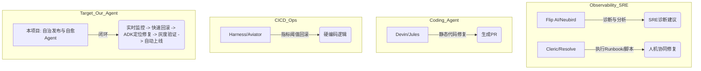
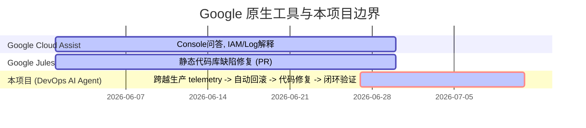

# DevOps AI Agent 竞品与差异化调研报告 (DevOps × AI Agent Hackathon 2026)

**分析时间**：2026-06-27  
**核心定位**：基于 **Gemini + ADK + Cloud Run** 的“自治发布 / 事故自愈”双循环 DevOps Agent。

---

## 一、 市面已有竞品盘点与深度解构

针对当前 DevOps 和 AI Agent 领域，我们将市面上的竞品分为五大类进行盘点，重点区分其**“营销话术”**与**“实际落地能力”**。

### (a) AI SRE / 事故响应 / 自动修复

| 竞品名称 | 厂商 / 背景 | 自治程度等级 | 强项 (Strengths) | 弱点 / 没做到的地方 (Gaps) |
| :--- | :--- | :--- | :--- | :--- |
| **Cleric** | 硅谷初创 (由 HashiCorp 前员工等创立) | **执行动作** (AI 调查员，能执行特定 Runbook) | 极强的 ChatOps 体验，能像一个 SRE 队友一样在 Slack 里拉取日志、分析 Trace 并解释故障根因。 | **无法做到闭环验证**。它通常在给出根因或提供修复建议后停止，不敢在没有人类确认的情况下自动更改线上代码或自主执行回滚。 |
| **Robusta / HolmesGPT** | Robusta (开源 K8s 运维工具) | **执行动作** (基于 CLI 的诊断和临时脚本执行) | 专门针对 Kubernetes，开源，开发者可以通过编写 Prompts 让 HolmesGPT 运行 Kubectl 命令诊断集群。 | **缺乏状态感知与上下文记忆**。HolmesGPT 是单次触发的诊断工具，无法长期跟踪一个发布版本的健康度，更没有 GitOps 代码修复闭环。 |
| **Flip AI** | 硅谷初创 (专注于 LLM observability) | **只给建议** (多模态数据关联与根因分析) | 强大的跨源数据关联能力。能够将 Splunk、Datadog、Sentry 的零散数据关联起来，几分钟内生成故障分析报告。 | **完全没有执行能力**。定位为“诊断仪”而非“手术刀”，不具备修改代码、触发 CI/CD 或操作云资源的能力。 |
| **PagerDuty Advance / Datadog Bits AI** | 传统监控巨头内置 AI | **只给建议** (警报总结与引导式排查) | 拥有最全的生产环境监控上下文和历史警报数据，开箱即用。 | **保守且动作受限**。受限于传统厂商的合规包袱，AI 仅用于总结警报、撰写 incident postmortem，无法跨出其平台去自主修改 GitHub 代码。 |

### (b) 自治编码 / PR 自动修复 / AI 代码评审

| 竞品名称 | 厂商 / 背景 | 自治程度等级 | 强项 (Strengths) | 弱点 / 没做到的地方 (Gaps) |
| :--- | :--- | :--- | :--- | :--- |
| **Devin** | Cognition | **执行动作** (端到端编码，生成 PR) | 长上下文解决复杂软件工程问题的能力，有独立的 Sandbox 运行和调试代码。 | **与生产环境脱节**。Devin 运行在离线的 Sandbox 中，完全不知道生产环境正在发生什么（如流量突增、内存泄漏、Sentry 报错）。 |
| **CodeRabbit / Qodo** | AI Code Review 赛道头部 | **只给建议** (PR 级别的静态分析和建议) | 速度极快，在 GitHub PR 下提供行级（line-by-line）的修改意见和安全审查。 | **被动式触发**。只在人类提交 PR 时工作，无法根据生产环境的 Bug 自动、主动地去拉分支并修复代码。 |
| **GitHub Copilot Autofix** | Microsoft / GitHub | **执行动作** (针对安全漏洞自动生成修复 PR) | 深度集成于 GitHub Advanced Security，扫描出漏洞后能自动生成修复代码。 | **仅限静态扫描自愈**。只能修复通过 SAST（静态扫描）发现的已知模式漏洞，无法处理由于运行时逻辑错误、依赖崩溃导致的生产故障。 |

### (c) CI/CD 自愈 / Flaky 测试 / 合并自动化

| 竞品名称 | 厂商 / 背景 | 自治程度等级 | 强项 (Strengths) | 弱点 / 没做到的地方 (Gaps) |
| :--- | :--- | :--- | :--- | :--- |
| **Aviator / Trunk** | 开发者工具初创公司 | **执行动作** (通过确定性规则自动化 Merge 队列) | 解决 flaky tests（易晃测试）的隔离，管理大规模团队的合并队列（Merge Queue），防止主分支被写脏。 | **缺乏语义级智能**。它们主要基于规则引擎和传统的脚本检测（如重试 3 次失败则隔离），不具备理解代码逻辑并主动“修复”测试代码的能力。 |
| **Harness AI** | Harness (持续集成/持续部署平台) | **闭环验证 + 自动回滚** (基于指标的 CD 回滚) | 其 Canary/Blue-Green 部署能够自动对比 Prometheus/Datadog 指标，异常时触发自动回滚。 | **非 Agent 化**。回滚是基于硬编码的 Prometheus 查询阈值（如 Error Rate > 1%），一旦异常只能回滚，无法“自动定位代码并提 PR 修复”。 |

### (d) FinOps / 自治云成本优化

| 竞品名称 | 厂商 / 背景 | 自治程度等级 | 强项 (Strengths) | 弱点 / 没做到的地方 (Gaps) |
| :--- | :--- | :--- | :--- | :--- |
| **Sedai** | 自治运维初创 | **闭环验证 + 自动执行** (自动调参和弹性伸缩) | 能够无侵入地调整 ECS/K8s 的 JVM 内存参数、CPU 分配，自动优化成本与并发性能。 | **专注于基础设施参数**。完全不涉及应用层代码（Application Code）的修改和故障修复，只做 Resizing 和 Scaling。 |

### (e) Google 原生技术生态（重点解析）

评委来自 Google，我们必须极其诚实地分析他们自家的工具，以找到我们的生存空间：

*   **Gemini Cloud Assist / Cloud Assist Investigations**
    *   *现状*：内置于 GCP 控制台侧边栏。用户遇到问题时，可以问它“为什么我的 Cloud Run 崩溃了？”或“如何配置这个 VPC？”。其 Investigations 功能可以总结 Cloud Logging 中的 Error。
    *   *自治程度*：**只给建议**。它是一个**被动式助理**。它不会在夜里 2 点监控到 Cloud Run 报错率上升时，自己登录 GitHub 拉分支、改代码、提 PR，并在 Canary 阶段监控它。
*   **Jules (Google 内部/Preview)**
    *   *现状*：Google 推出的一款自主开发 Agent，能够阅读代码库、定位 bug 并尝试修复。
    *   *自治程度*：**执行动作**。但它完全**没有生产环境上下文**。Jules 的工作流是：输入一个 Issue 描述 -> 产出代码修改。它不监听 Sentry，不与 Cloud Run 的 Revision 流量管理联动，没有“在线灰度验证-回滚”的闭环。
*   **ADK (Agent Development Kit) / Vertex AI Agent Engine**
    *   *现状*：Google 官方提供的 Agent 开发框架。提供了与 Vertex AI 交互的模板、工具调用规范（Tool Call）。
    *   *自治程度*：**基建平台**。它不提供具体的 DevOps 业务逻辑，是我们需要使用的“武器库”。
*   **Antigravity**
    *   *现状*：Google 内部高效的 agentic coding 辅助环境。
    *   *自治程度*：**基建平台**。提供代码上下文理解与修改的 Agent 运行环境。

---

## 二、 可学习的最佳实践模式

在设计我们的架构时，应吸收业界已被证实的优秀模式：

1.  **ChatOps 交互作为“安全阀” (源自 Cleric / Slack-first)**
    *   完全的“无人值守”在生产环境是不现实的。我们应该在 Slack/Dashboard 中呈现 Agent 的**思考链（CoT）**，并提供一条“Dual-Key”确认通道：对于高风险动作（如合并 PR 到 main），Agent 准备好一切，等待人类在 Slack 点击 `[Approve & Merge]`。对于低风险动作（如回滚 Cloud Run 流量到上一个 revision），Agent 可自主执行并在 Slack 广播。
2.  **灰度流量分流验证 (源自 Harness / Cast.ai)**
    *   修复 PR 被合并部署后，不能直接 100% 导入线上。必须将新 Revision 的流量限制在 5%-10%，由 Agent 持续监控 5 分钟的 Sentry / Cloud Logging。无异常再逐步放大到 100%。如果异常，一秒回滚。
3.  **多源上下文融合 (源自 Flip AI)**
    *   AI 定位 Bug 不能只看 Stack Trace。必须同时打包：Sentry 报错详情 + 发生故障前 10 分钟的 Git Commit Log（看看是谁提交了什么） + Cloud Run HTTP 状态码指标。

---

## 三、 市场空白 / 痛点分析（还没人做好的地方）

我们要在 Hackathon 中脱颖而出，就必须死磕以下行业痛点：

1.  **“Telemetry $\rightarrow$ GitOps” 的断层 (The Telemetry-to-GitOps Loop)**
    *   *现状*：监控工具（Sentry/Datadog）只管报警；编码 Agent（Devin/Jules）只管写代码。**没有人在中间把它们连起来**。
    *   *机会*：构建首个“Sentry 报错 $\rightarrow$ 关联 Git 历史 $\rightarrow$ Gemini ADK 生成 Fix PR $\rightarrow$ Cloud Build 部署 $\rightarrow$ 监控验证”的端到端闭环。
2.  **提交前的“自我纠错”与沙箱回放 (Pre-commit Sandbox Replay)**
    *   *现状*：很多 Agent 生成的修复代码在真实 CI 中都过不去（编译失败、测试挂掉）。
    *   *机会*：在 ADK 代理端，利用本地/沙箱环境，自动从日志中提取导致崩溃的 HTTP Payload / Input，在本地回放，确认修复成功后再提交 PR。
3.  **GitOps 审计与安全边界 (Non-privileged Production Write)**
    *   *现状*：SRE 团队绝不允许 AI Agent 拥有生产环境的直接 SSH/Write 权限。
    *   *机会*：**Agent 只有 Git 的 PR 提交权，没有生产代码的直接修改权**。所有的代码自愈必须通过真实 CI/CD 管道（Cloud Build -> Artifact Registry -> Cloud Run），确保每一行代码都在 Git 历史中可审计。

---

## 四、 差异化与特殊卖点 (USPs) 规划

基于“**新颖性** $\times$ **2周可行性** $\times$ **对 Google 评委的吸引力**”进行排序，为我们的项目量身定制 5 个差异化卖点：

### USP 1: “双轨自愈”机制 (Fast/Slow Track Remediation) —— 🏆 核心卖点
*   **做法**：当检测到生产故障（如 Sentry 触发 Webhook）：
    *   **快轨 (Fast-Track Mitigation)**：Agent 立即调用 GCP API，将 Cloud Run 流量 100% 切换回上一个健康的 Revision（在 30 秒内挽救生产）。
    *   **慢轨 (Slow-Track Resolution)**：Agent 启动 ADK 编码工作流，读取报错堆栈，在沙箱中重现 Bug，生成修复 PR，通过真实 CI/CD 重新发布新版本进行灰度验证。
*   **可行性 (2周)**：极高。Cloud Run 的多版本流量比例划分（Traffic Splitting）是原生支持的，API 调用极快；ADK 负责 PR 部分。
*   **Google 评委吸引力**：极高。完美展现了 Cloud Run 领先于 AWS ECS 的 Revision 流量控制优势。

### USP 2: “沙箱回放”自我纠错 (Sandbox Payload Replay)
*   **做法**：Agent 拦截 Cloud Logging 中的 Crash Payload。在 ADK 编码修复后，Agent 不急于提交 PR，而是在一个本地沙箱容器里启动应用，用 `curl` 回放该 Payload。只有当应用不再 Crash 且返回 200 时，Agent 才把 PR 提交给人类。
*   **可行性 (2周)**：中等。可以通过编写一个通用的 Python 测试执行脚本，由 Agent 在 Sandbox 中运行。
*   **Google 评委吸引力**：极高。这展示了超群的“Agentic Evaluation / Self-Correction”能力，而非简单的 LLM 代码生成。

### USP 3: 可视化“思考链”监控看板 (The Inner Monologue Dashboard)
*   **做法**：做一个极具极客风的 Dashboard（使用 CSS 玻璃拟态/暗黑模式）。当事故发生时，看板实时流式展示 Agent 的思考过程：
    1. `[Telemetry]` 收到 Sentry 告警：`ZeroDivisionError` 于 `user.go:42`。
    2. `[Context]` 检索最近提交：发现 5 分钟前 `jason` 提交的 commit `a1b2c3` 修改了该文件。
    3. `[Fast Remediation]` 自动将 Cloud Run 流量切回 `rev-042` (旧版本)，当前错误率降至 0%。
    4. `[Analysis]` 启动 ADK 分析代码：定位到除数可能为 0。
    5. `[Sandbox]` 运行测试：`TestDivisionByZero` 失败 $\rightarrow$ 尝试添加 `if == 0` 保护 $\rightarrow$ 测试通过。
    6. `[GitOps]` 已向 GitHub 提交修复分支 `fix/zero-division` 并提 PR。
*   **可行性 (2周)**：高。利用 WebSockets 从 Agent 实时 Push 状态日志到前端。
*   **Google 评委吸引力**：极高（Wow 效果）。评委最喜欢直观、有视觉冲击力的“Agent 思考过程可视化”，这是 Hackathon 拿奖的标配。

### USP 4: 灰度部署的“Agent-driven Canary Gate”
*   **做法**：当修复 PR 被合并后，Cloud Build 触发。新版本上线时，Agent 自动接管 Cloud Run 流量。先切 10% 流量给新版本，Agent 开始在后台“读秒”监控（例如 180 秒）。如果在 180 秒内没有新 Sentry 报错，自动切到 50%，最后 100%。如果期间有任何一条新报错，瞬间切回 0%，并在 PR 下留评论：“Canary 验证失败，报错如下...”。
*   **可行性 (2周)**：极高。只需一个周期性轮询监控指标的 Agent Loop（使用 GCP API 控制流量）。
*   **Google 评委吸引力**：高。充分展现了将 AI Agent 融入传统 DevOps 安全防御性策略的最佳实践。

### USP 5: 基于 ADK 的 Google Cloud Assist 边界扩展者
*   **做法**：在宣传时，我们明确将自己定位为 **“Google 官方 Cloud Assist 与 Jules 的桥梁”**。告诉评委：Google Cloud Assist 负责“告诉你怎么做”，Jules 负责“写代码”，而**我们的 Agent 则是将两者与生产运行环境（Cloud Run + Operations Suite）强力粘合的“自治调度器”**。
*   **可行性 (2周)**：偏向概念定位，在 Demo 和 Slides 中重点阐述。
*   **Google 评委吸引力**：极高。评委（通常是 GCP 的产品经理或架构师）非常乐意看到开发者基于他们的底层 API（Vertex/ADK）去补充他们还没来得及做的“闭环最后一公里”。

---

## 五、 与 Google 原生工具的明确区分表

| 功能维度 | Google Gemini Cloud Assist | Google Jules | 本项目 (DevOps AI Agent) |
| :--- | :--- | :--- | :--- |
| **触发机制** | 用户被动提问 (Console Chat) | 用户输入 Issue / 静态触发 | **生产环境监控指标 / 异常主动触发 (Event-Driven)** |
| **执行权限** | 无生产写权限，仅提供命令行建议 | 仅代码库读写权限 | **GitOps 安全写入 + GCP Cloud Run 流量控制权** |
| **自愈机制** | 无 | 无 | **双轨自愈：秒级 Revision 回滚 + 慢轨代码修复** |
| **运行期验证** | 无 | 无 | **Canary 灰度流量智能监控与自动晋级/回退** |

---

## 六、 总结与下阶段行动项 (Next Steps)

这个定位完美避开了与 Google 官方大模型的正面竞争（我们不做模型，也不做通用的 Coding 平台），而是选择做 **“Cloud Run 专属的 GitOps 自愈闭环”**。

1.  **架构设计**：采用 Event-driven 架构。Sentry Webhook $\rightarrow$ GCP Cloud Pub/Sub $\rightarrow$ Auto-Healing Agent (运行在 Cloud Run 上，使用 Gemini + ADK)。
2.  **技术验证 (Feasibility Check)**：
    *   验证如何通过 GCP SDK 动态调整 Cloud Run 的 Revision 流量比例。
    *   使用 Gemini ADK 在 Sandbox 中拉取代码、修改并提交 GitHub PR。
3.  **UI 动工**：同步开始设计 USP 3 的“思考链可视化大屏”，确保 Hackathon Demo 的第一视觉效果。
