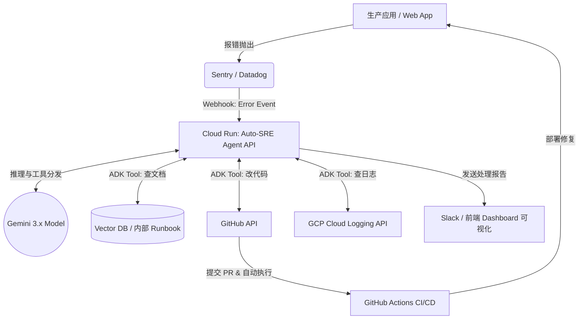

Reading prompt from stdin...
OpenAI Codex v0.133.0
--------
workdir: /private/tmp/claude-501/-Users-jason-Documents-AI-Agent-Hackathon/281a9f7e-2800-46f5-8641-472a7efed1b6/scratchpad
model: gpt-5.5
provider: openai
approval: never
sandbox: danger-full-access
reasoning effort: xhigh
reasoning summaries: none
session id: 019f09b7-8a21-7ed3-835d-ff79b6cc03de
--------
user
# 第三轮调研:技术可行性 & 落地路径 + 用户 & 市场验证

项目:自治「发布/事故自愈」DevOps Agent。核心闭环=**独立生产告警(含部署窗口外)→ 自动把 Cloud Run 流量切回上一健康 revision 止血 → 同时 Gemini/ADK 开修复 PR 走真 CI/CD 根治 → 用 Cloud Logging/Monitoring 证明错误率归零 → 撤销临时回滚**;默认无人值守(有回滚兜底),可视化思考链。必用 Gemini + ADK + Cloud Run。团队小、距 7/10 提交仅 ~12 天。今天 2026-06-28。

请用**中文**,**具体可落地、带命令/代码骨架、诚实**(做不到的明说)。分两个 Track 输出。

## Track A — 技术可行性 & 落地路径(目标:能立刻开工,把不确定性降到最低)
1. **ADK(Agent Development Kit)**:首选什么语言(Python / Java / TS)?怎么定义多 agent + 状态机/workflow(Sequential/Parallel/Loop/LlmAgent)?怎么做 tool calling、怎么部署到 Cloud Run 或 Vertex Agent Engine、怎么做 evaluation?给**最小骨架代码**。
2. **Cloud Run 回滚**:怎么用 `gcloud run services update-traffic --to-revisions=REV=100` / Cloud Run Admin API v2 把流量切回上一个健康 revision?怎么列 revision 历史、怎么定位"哪次 revision 引入故障"?给**确切命令/API**。
3. **Gemini**:怎么用 structured outputs / controlled generation(responseSchema)/ function calling 驱动状态机决策?
4. **监控验证**:怎么用 Cloud Monitoring / Logging API 查"错误率"(log-based metrics / MQL / PromQL)、怎么判定"归零"?告警怎么配(alert policy + notification channel webhook)?
5. **触发**:Cloud Monitoring 告警 webhook 或 Sentry webhook → Cloud Run endpoint 的接线。
6. **修复 PR + CI**:用 GitHub App/API 开 PR、GitHub Actions 或 Cloud Build 跑 CI、提交前自我纠错回路。
7. **IAM/Service Account 最小权限 + Secret Manager**。
8. **已知坑** + **最小可验证技术切片(「延迟炸弹回滚」)** 该先验证什么、按什么顺序。
→ 给一个「2 周内最稳的技术栈选型结论」+ 列出**高风险待验证点**(哪些可能做不出来)。

## Track B — 用户 & 市场验证
1. **ICP / 目标用户**到底是谁(Cloud Run 上的独立开发者/小团队?中型 SRE 团队?),最痛的场景是什么。
2. **真实需求强度 + 付费意愿**;参考竞品定价(Resolve.ai / Cleric / incident.io / Datadog Bits / Harness / Sedai / PagerDuty)。
3. **AI SRE / 自治修复市场**趋势与规模。
4. **「とどける/实务」叙事**:为什么这是真产品不是 demo;商业化/GTM 故事怎么讲。
5. **对评委**:这个产品的"实务价值(実務で活きる)"怎么证明给 GCP 评委看。

2026-06-27T15:34:11.820829Z ERROR rmcp::transport::worker: worker quit with fatal: Transport channel closed, when AuthRequired(AuthRequiredError { www_authenticate_header: "Bearer realm=\"OAuth\", resource_metadata=\"https://mcp.notion.com/.well-known/oauth-protected-resource/mcp\", error=\"invalid_token\", error_description=\"Missing or invalid access token\"" })
codex
我会先快速看一下 scratchpad 里是否已有前两轮调研或项目笔记，避免重复结论；随后用官方文档和竞品公开页补齐最新技术/市场信息。
exec
/bin/zsh -lc 'pwd && rg --files' in /private/tmp/claude-501/-Users-jason-Documents-AI-Agent-Hackathon/281a9f7e-2800-46f5-8641-472a7efed1b6/scratchpad
 succeeded in 0ms:
/private/tmp/claude-501/-Users-jason-Documents-AI-Agent-Hackathon/281a9f7e-2800-46f5-8641-472a7efed1b6/scratchpad
out_codex_comp.md
codex_done.flag
out_gemini_pro.md
brief.md
out_gemini_flash.md
out_gemini_pro_r3.md
brief_competitors.md
out_gemini_flash_comp.md
out_codex_r3.md
daily-log-2026-06-27.md
out_codex.md
codex_comp_done.flag
out_gemini_pro_comp.md
brief_round3.md
agy_comp_done.flag
agy_done.flag

codex
我找到了第三轮 brief 和多份模型输出。接下来先读 brief 与已有结果，提炼可复用结论，再针对不确定点查官方/公开来源。
exec
/bin/zsh -lc "sed -n '1,240p' brief_round3.md" in /private/tmp/claude-501/-Users-jason-Documents-AI-Agent-Hackathon/281a9f7e-2800-46f5-8641-472a7efed1b6/scratchpad
exec
/bin/zsh -lc "sed -n '1,260p' out_codex_r3.md" in /private/tmp/claude-501/-Users-jason-Documents-AI-Agent-Hackathon/281a9f7e-2800-46f5-8641-472a7efed1b6/scratchpad
 succeeded in 0ms:
# 第三轮调研:技术可行性 & 落地路径 + 用户 & 市场验证

项目:自治「发布/事故自愈」DevOps Agent。核心闭环=**独立生产告警(含部署窗口外)→ 自动把 Cloud Run 流量切回上一健康 revision 止血 → 同时 Gemini/ADK 开修复 PR 走真 CI/CD 根治 → 用 Cloud Logging/Monitoring 证明错误率归零 → 撤销临时回滚**;默认无人值守(有回滚兜底),可视化思考链。必用 Gemini + ADK + Cloud Run。团队小、距 7/10 提交仅 ~12 天。今天 2026-06-28。

请用**中文**,**具体可落地、带命令/代码骨架、诚实**(做不到的明说)。分两个 Track 输出。

## Track A — 技术可行性 & 落地路径(目标:能立刻开工,把不确定性降到最低)
1. **ADK(Agent Development Kit)**:首选什么语言(Python / Java / TS)?怎么定义多 agent + 状态机/workflow(Sequential/Parallel/Loop/LlmAgent)?怎么做 tool calling、怎么部署到 Cloud Run 或 Vertex Agent Engine、怎么做 evaluation?给**最小骨架代码**。
2. **Cloud Run 回滚**:怎么用 `gcloud run services update-traffic --to-revisions=REV=100` / Cloud Run Admin API v2 把流量切回上一个健康 revision?怎么列 revision 历史、怎么定位"哪次 revision 引入故障"?给**确切命令/API**。
3. **Gemini**:怎么用 structured outputs / controlled generation(responseSchema)/ function calling 驱动状态机决策?
4. **监控验证**:怎么用 Cloud Monitoring / Logging API 查"错误率"(log-based metrics / MQL / PromQL)、怎么判定"归零"?告警怎么配(alert policy + notification channel webhook)?
5. **触发**:Cloud Monitoring 告警 webhook 或 Sentry webhook → Cloud Run endpoint 的接线。
6. **修复 PR + CI**:用 GitHub App/API 开 PR、GitHub Actions 或 Cloud Build 跑 CI、提交前自我纠错回路。
7. **IAM/Service Account 最小权限 + Secret Manager**。
8. **已知坑** + **最小可验证技术切片(「延迟炸弹回滚」)** 该先验证什么、按什么顺序。
→ 给一个「2 周内最稳的技术栈选型结论」+ 列出**高风险待验证点**(哪些可能做不出来)。

## Track B — 用户 & 市场验证
1. **ICP / 目标用户**到底是谁(Cloud Run 上的独立开发者/小团队?中型 SRE 团队?),最痛的场景是什么。
2. **真实需求强度 + 付费意愿**;参考竞品定价(Resolve.ai / Cleric / incident.io / Datadog Bits / Harness / Sedai / PagerDuty)。
3. **AI SRE / 自治修复市场**趋势与规模。
4. **「とどける/实务」叙事**:为什么这是真产品不是 demo;商业化/GTM 故事怎么讲。
5. **对评委**:这个产品的"实务价值(実務で活きる)"怎么证明给 GCP 评委看。

 succeeded in 0ms:
Reading prompt from stdin...
OpenAI Codex v0.133.0
--------
workdir: /private/tmp/claude-501/-Users-jason-Documents-AI-Agent-Hackathon/281a9f7e-2800-46f5-8641-472a7efed1b6/scratchpad
model: gpt-5.5
provider: openai
approval: never
sandbox: danger-full-access
reasoning effort: xhigh
reasoning summaries: none
session id: 019f09b7-8a21-7ed3-835d-ff79b6cc03de
--------
user
# 第三轮调研:技术可行性 & 落地路径 + 用户 & 市场验证

项目:自治「发布/事故自愈」DevOps Agent。核心闭环=**独立生产告警(含部署窗口外)→ 自动把 Cloud Run 流量切回上一健康 revision 止血 → 同时 Gemini/ADK 开修复 PR 走真 CI/CD 根治 → 用 Cloud Logging/Monitoring 证明错误率归零 → 撤销临时回滚**;默认无人值守(有回滚兜底),可视化思考链。必用 Gemini + ADK + Cloud Run。团队小、距 7/10 提交仅 ~12 天。今天 2026-06-28。

请用**中文**,**具体可落地、带命令/代码骨架、诚实**(做不到的明说)。分两个 Track 输出。

## Track A — 技术可行性 & 落地路径(目标:能立刻开工,把不确定性降到最低)
1. **ADK(Agent Development Kit)**:首选什么语言(Python / Java / TS)?怎么定义多 agent + 状态机/workflow(Sequential/Parallel/Loop/LlmAgent)?怎么做 tool calling、怎么部署到 Cloud Run 或 Vertex Agent Engine、怎么做 evaluation?给**最小骨架代码**。
2. **Cloud Run 回滚**:怎么用 `gcloud run services update-traffic --to-revisions=REV=100` / Cloud Run Admin API v2 把流量切回上一个健康 revision?怎么列 revision 历史、怎么定位"哪次 revision 引入故障"?给**确切命令/API**。
3. **Gemini**:怎么用 structured outputs / controlled generation(responseSchema)/ function calling 驱动状态机决策?
4. **监控验证**:怎么用 Cloud Monitoring / Logging API 查"错误率"(log-based metrics / MQL / PromQL)、怎么判定"归零"?告警怎么配(alert policy + notification channel webhook)?
5. **触发**:Cloud Monitoring 告警 webhook 或 Sentry webhook → Cloud Run endpoint 的接线。
6. **修复 PR + CI**:用 GitHub App/API 开 PR、GitHub Actions 或 Cloud Build 跑 CI、提交前自我纠错回路。
7. **IAM/Service Account 最小权限 + Secret Manager**。
8. **已知坑** + **最小可验证技术切片(「延迟炸弹回滚」)** 该先验证什么、按什么顺序。
→ 给一个「2 周内最稳的技术栈选型结论」+ 列出**高风险待验证点**(哪些可能做不出来)。

## Track B — 用户 & 市场验证
1. **ICP / 目标用户**到底是谁(Cloud Run 上的独立开发者/小团队?中型 SRE 团队?),最痛的场景是什么。
2. **真实需求强度 + 付费意愿**;参考竞品定价(Resolve.ai / Cleric / incident.io / Datadog Bits / Harness / Sedai / PagerDuty)。
3. **AI SRE / 自治修复市场**趋势与规模。
4. **「とどける/实务」叙事**:为什么这是真产品不是 demo;商业化/GTM 故事怎么讲。
5. **对评委**:这个产品的"实务价值(実務で活きる)"怎么证明给 GCP 评委看。

2026-06-27T15:34:11.820829Z ERROR rmcp::transport::worker: worker quit with fatal: Transport channel closed, when AuthRequired(AuthRequiredError { www_authenticate_header: "Bearer realm=\"OAuth\", resource_metadata=\"https://mcp.notion.com/.well-known/oauth-protected-resource/mcp\", error=\"invalid_token\", error_description=\"Missing or invalid access token\"" })
codex
我会先快速看一下 scratchpad 里是否已有前两轮调研或项目笔记，避免重复结论；随后用官方文档和竞品公开页补齐最新技术/市场信息。
exec
/bin/zsh -lc 'pwd && rg --files' in /private/tmp/claude-501/-Users-jason-Documents-AI-Agent-Hackathon/281a9f7e-2800-46f5-8641-472a7efed1b6/scratchpad
 succeeded in 0ms:
/private/tmp/claude-501/-Users-jason-Documents-AI-Agent-Hackathon/281a9f7e-2800-46f5-8641-472a7efed1b6/scratchpad
out_codex_comp.md
codex_done.flag
out_gemini_pro.md
brief.md
out_gemini_flash.md
out_gemini_pro_r3.md
brief_competitors.md
out_gemini_flash_comp.md
out_codex_r3.md
daily-log-2026-06-27.md
out_codex.md
codex_comp_done.flag
out_gemini_pro_comp.md
brief_round3.md
agy_comp_done.flag
agy_done.flag

codex
我找到了第三轮 brief 和多份模型输出。接下来先读 brief 与已有结果，提炼可复用结论，再针对不确定点查官方/公开来源。

exec
/bin/zsh -lc "sed -n '1,260p' out_gemini_pro_r3.md" in /private/tmp/claude-501/-Users-jason-Documents-AI-Agent-Hackathon/281a9f7e-2800-46f5-8641-472a7efed1b6/scratchpad
 succeeded in 0ms:
exec
/bin/zsh -lc "sed -n '1,220p' daily-log-2026-06-27.md" in /private/tmp/claude-501/-Users-jason-Documents-AI-Agent-Hackathon/281a9f7e-2800-46f5-8641-472a7efed1b6/scratchpad
 succeeded in 0ms:
# Daily Log - 2026-06-27

## DevOps AI Agent Hackathon

- Moved forward: researched competitor landscape for autonomous release / incident self-healing agent, covering AI SRE, autonomous coding, CI/CD self-healing, FinOps, and Google-native agent tooling.
- Changed: positioning should avoid generic Cloud Assist/Jules overlap and emphasize a narrow Cloud Run production control loop: detect, rollback, verify, open fix PR, and preserve audit trail.
- Blocked: no implementation validation yet; next step is to choose MVP scope and wire a demo app, fault injection, Cloud Monitoring/Sentry signal, Cloud Run traffic rollback, and GitHub PR flow.
- Matters tomorrow: turn differentiators into architecture and day-by-day build plan before coding.

codex
已有日志里的关键点是：定位已经收窄到 Cloud Run 的生产控制闭环，但还没有做实现验证。现在我会查官方文档确认 ADK、Cloud Run traffic、Monitoring/Logging webhook、Gemini schema/function calling 的具体可执行接口。
exec
/bin/zsh -lc 'wc -l out_codex_r3.md out_gemini_pro_r3.md out_gemini_flash.md out_gemini_flash_comp.md out_gemini_pro.md out_codex.md brief_competitors.md' in /private/tmp/claude-501/-Users-jason-Documents-AI-Agent-Hackathon/281a9f7e-2800-46f5-8641-472a7efed1b6/scratchpad
exec
/bin/zsh -lc "sed -n '1,260p' out_gemini_flash.md" in /private/tmp/claude-501/-Users-jason-Documents-AI-Agent-Hackathon/281a9f7e-2800-46f5-8641-472a7efed1b6/scratchpad
 succeeded in 0ms:
已为您生成了一份详尽的 **DevOps × AI Agent Hackathon 2026 参赛调研与执行方案**，并已作为 Artifact 写入项目目录。

您可以通过以下链接直接查看：
👉 **[hackathon_research_report.md](file:///Users/jason/.gemini/antigravity-cli/brain/9f47bdda-666a-429d-9601-096442d8da54/hackathon_research_report.md)**

---

### 🔑 关键决策与探讨
为了让我们能在接下来的 2 周内快速落地 MVP，有以下几个关键决策需要您的意见：

1. **项目选择**：我最推荐的是 **[点子 1] OpsPulse (Sentry 告警自愈与验证 Agent)**。您是否同意以此作为参赛项目？或者您对其他 5 个点子（如 Cloud Run FinOps 调优、SafeSchema 等）更有兴趣？
2. **调试策略**：第一阶段我们需要搭建一个“靶场”目标 App。您倾向于使用真实的 Sentry Webhook 与真实 PR 流程，还是优先在本地环境使用 Mock 服务来加速 Agent 核心逻辑的调试？

如果您想针对架构细节进行深入对齐，建议您可以使用 `/grill-me` 让我对您进行一次简短的方案对齐访谈；或者使用 `/goal` 让我们直接锁定第一阶段的任务并开始编写靶场代码！

 succeeded in 0ms:
     174 out_codex_r3.md
       0 out_gemini_pro_r3.md
      14 out_gemini_flash.md
     177 out_gemini_flash_comp.md
     117 out_gemini_pro.md
     752 out_codex.md
      18 brief_competitors.md
    1252 total

exec
/bin/zsh -lc "sed -n '1,260p' out_gemini_pro.md" in /private/tmp/claude-501/-Users-jason-Documents-AI-Agent-Hackathon/281a9f7e-2800-46f5-8641-472a7efed1b6/scratchpad
 succeeded in 0ms:
这是一份专为你的技术栈和时间线（剩 2 周）量身定制的 **DevOps × AI Agent Hackathon 2026** 参赛调研与执行报告。

### 1. 提交物清单（推断的 Deliverables）
为了在「つくる、まわす、とどける」三方面拿满分，你需要准备以下提交物（按重要度排序）：
1. **可交互的 Demo 视频（最重要，3-5 分钟）**：评委没时间自己跑所有项目。视频必须真实展示：触发警报/事件 -> Agent **自动接管** -> Agent 调用工具解决问题 -> 恢复绿灯的完整闭环。
2. **部署好的 Web 界面 / 仪表盘 URL**：托管在 Cloud Run 上。即使 Agent 是后端的，也需要一个前端（Next.js/React）来可视化 Agent 的思考过程（Thought Process）、调用的工具、执行的日志。
3. **架构与设计文档（重点考察「必要性与自治设计」）**：
   - 核心系统图（数据如何流经 GitHub/监控 -> Cloud Run -> Gemini ADK）。
   - **自治状态机说明**：明确说明 Agent 在遇到不同情况时，如何自主决策（而不只是大模型生硬的一问一答）。
4. **GitHub 开源仓库**：包含完整的 IaC（如果是 GCP Terraform/Pulumi）或部署配置（`cloudbuild.yaml` 或 GitHub Actions workflow），证明「まわす」（CI/CD 闭环）真实存在。

---

### 2. 具体项目点子（按 "2周可行性 × 契合度" 排序）

#### 💡 #1：Auto-SRE 故障自愈专家 (Agentic SRE Responder) 
- **一句话定位**：当生产环境或流水线报错时，自动诊断、查阅文档、并执行回滚或热修复的自治 SRE 机器人。
- **Agent 自治做什么**：不只是“报警”，而是接收 Sentry/Datadog Webhook，**自主拉取**最新错误日志，**自主查阅**对应的内部 Runbook（通过 RAG），决定是“安全回滚”还是“生成修复代码并提 PR”。
- **使用组件**：Gemini 3.x (高阶推理), Gemini ADK (工具调用: GitHub API, Sentry API), Cloud Run (承载 Agent Webhook)。
- **「まわす」(CI/CD)**：Agent 本身通过 GitHub Actions 部署；当它生成修复 PR 并合并后，触发应用的自动 CI/CD。
- **「とどける」(交付)**：作为微服务部署在 Cloud Run 上，高可用，随时响应警报。
- **评委青睐点**：直击 DevOps 痛点，完全展示了“必须自治”的理由（半夜宕机需要秒级响应，人类来不及）。
- **可行性/MVP**：**高**。2周内可硬编码特定的错误类型（如 NullPointer 或 内存溢出）演示全流程。

#### 💡 #2：云成本刺客 (Autonomous FinOps Agent)
- **一句话定位**：自动寻找、关停闲置资源，并自动生成 IaC 修改 PR 的省钱 Agent。
- **Agent 自治做什么**：定时轮询 Google Cloud Billing 和监控指标。如果发现闲置的 Cloud Run 实例、无流量的 DB，它不只是发报告，而是**直接调用 GCP API 缩容**，并向代码库提交 Terraform/IaC 的降配 PR。
- **使用组件**：Gemini 3.x, Cloud Scheduler (触发), Cloud Functions/Run, GCP Billing/Compute API。
- **「まわす」(CI/CD)**：Agent 修改的 IaC 代码触发 CI 测试，确保降配不会导致语法或依赖错误。
- **「とどける」(交付)**：通过 Cloud Run 定时任务（Job）无缝部署交付。
- **评委青睐点**：商业价值极高，结合了云原生运维，企业非常愿意买单。
- **可行性/MVP**：**高**。MVP 只需针对一种资源（如忘记删除的测试环境 Cloud Run 服务）做自动清理。

#### 💡 #3：CI/CD 绿灯侠 (Pipeline Auto-Healer)
- **一句话定位**：自动修复构建失败和测试用例不通过的 CI/CD 守护者。
- **Agent 自治做什么**：监听 GitHub Actions 失败事件，自主阅读失败日志，克隆代码在沙盒中尝试修复，跑通测试后，自动把修复代码 push 上去。
- **使用组件**：Gemini ADK (用于沙盒代码执行和沙盒验证), GitHub Webhooks, Cloud Run。
- **「まわす」(CI/CD)**：完美融入现有的 CI/CD 流程中，属于 "CI/CD for CI/CD"。
- **「とどける」(交付)**：Agent 逻辑通过 Cloud Build 打包交付。
- **评委青睐点**：“自己跑，自己修，自己交付”，极度贴合 Hackathon 主题。
- **可行性/MVP**：**中高**。2周内可以只针对特定语言（如 TypeScript/Node 的 Jest 测试失败或 Lint 报错）做精准修复。

#### 💡 #4：合规与安全漏洞自动封堵者 (SecOps Patcher Agent)
- **一句话定位**：不仅扫描漏洞，还自动改代码、发包、测试的 SecOps Agent。
- **Agent 自治做什么**：收到 Dependabot 或 Snyk 的高危漏洞通知后，自主拉取代码，修改 `package.json` 并解决破坏性更新（Breaking Changes）导致的代码报错，测试通过后自动合并。
- **使用组件**：Gemini Enterprise Agent Platform (处理复杂的代码逻辑推理), Cloud Run。
- **评委青睐点**：比传统的 Dependabot 强在“自动解决 breaking changes”。
- **可行性/MVP**：**中**。依赖树可能很复杂，MVP 需限定在一个小型 React/Next 项目。

#### 💡 #5：Chaos Agent (混沌工程自治测试员)
- **一句话定位**：在预发环境像“猴子”一样自动搞破坏，并自动出具系统韧性报告的 Agent。
- **Agent 自治做什么**：自主决定关闭哪些服务、注入什么网络延迟，然后观察监控系统。如果发现系统能扛住，就继续加码；扛不住，自动终止破坏并记录弱点。
- **使用组件**：GCP API, Datadog API, Gemini 3.x。
- **评委青睐点**：概念非常酷，展现了高阶的自治决策逻辑。
- **可行性/MVP**：**中低**。2周内实现安全的“破坏”较难，容易做成纯脚本。

#### 💡 #6：环境幽灵 (Ephemeral Environment Manager)
- **一句话定位**：让每一个 PR 自动拥有全套云原生环境的调度 Agent。
- **Agent 自治做什么**：看懂 PR 的意图，自主向 GCP 申请恰到好处的资源（数据库、Redis、Cloud Run），注入假数据，把链接贴给 Reviewer，合并后自动销毁。
- **评委青睐点**：解决微服务本地难以测试的痛点。
- **可行性/MVP**：**低**。涉及太多基础设施脚手架工作，2周容易干不完。

---

### 3. 最推荐的点子：Auto-SRE 故障自愈专家

**为什么选它**：最能体现大模型 Agent 的“推理+执行”能力，结合了你熟练的 TypeScript/Node/Sentry/GCP 栈，2周完全做得出惊艳的 Demo。

#### 核心架构图 (Data Flow)


#### 2 周冲刺里程碑 (MVP 计划)
- **Day 1-2 (基建与 Demo 靶机)**：
  - 用 Next.js 写一个极其容易抛错的“靶机”应用（比如点击按钮就抛出一个前端 API 错误，或后端 Null 处理错误）。
  - 配置靶机的 GitHub Actions CI/CD，部署到 Cloud Run。接入 Sentry 捕获错误。
- **Day 3-6 (Agent 核心大脑构建)**：
  - 使用 TS/Node 初始化 Agent 服务，部署到 Cloud Run。
  - 使用 Gemini ADK 定义 Agent 工具（Tools）：`get_sentry_trace()`, `read_github_file()`, `create_github_pr()`。
  - 编写自治 Prompt：“你是一个 SRE Agent。收到 Webhook 后，你必须弄清楚错误原因，找到对应的源码，修改它，并提交 PR。”
- **Day 7-9 (闭环与打通「まわす」)**：
  - 测试联调：点击靶机按钮 -> Sentry 发出 Webhook -> Agent 拉取代码 -> Agent 用 Gemini 3.x 生成 Fix -> Agent 提交 PR。
  - 配置 CI 测试 PR。
- **Day 10-12 (界面可视化「とどける」)**：
  - 开发一个酷炫的深色模式前端 Dashboard（你的强项，Vercel 部署即可）。实时通过 WebSocket 或轮询展示 Agent 的思考过程：“收到警报 -> 正在分析堆栈 -> 发现 `utils.ts` 第 45 行有 Bug -> 正在生成补丁 -> PR #12 已提交”。（**这一步是拿奖的关键，评委需要直观看到 Agent 在干嘛**）。
- **Day 13-14 (打磨视频与文档)**：
  - 录屏一气呵成：制造故障 -> 屏幕一侧是前台报错，一侧是 Agent Dashboard 疯狂跳动思考 -> GitHub 出现 PR -> 自动合并 -> 故障恢复。完成 PPT 与架构图。

---

### 4. 制胜策略与常见踩坑

#### 如何最大化拿分
1. **死磕「必要性与自治执行」**：评委最讨厌“只是套了个壳的 ChatGPT”。你的 Agent 必须能在**无人干预**的情况下执行 `git commit` 或调用 GCP API。在架构文档中重点描述你的 Agent 是如何处理失败重试的（例如：Agent 提交的代码 CI 没跑过，Agent 应该能看到 CI 日志，并**自动发起第二次尝试**，这就是终极自治）。
2. **可视化 Thought Process**：Agent 在后台默默把事办了，对用户是好事，对黑客松是灾难。**一定要让 Agent “大声思考”**。将 Agent 调用的每一个 ADK Tool、每一次大模型返回的中间结果，打印在你的 Dashboard 上。
3. **原生结合 Google Cloud**：既然 Google Cloud 协赞，一定要重度使用其服务。不仅仅是用 Gemini API，你的 Agent 跑在 Cloud Run，用 Cloud Logging 查日志，用 Secret Manager 存 GitHub Token。
4. **Agent 的「まわす」**：你的 Agent 自身的代码也需要有 CI/CD。向评委展示你使用 GitHub Actions 实现了 Agent 的持续部署，证明你懂 DevOps。

#### 常见踩坑
- **坑 1：坑在基建上**。花了一周半搭建 Kubernetes，导致 Agent 没写完。**对策**：全部用 Serverless（Cloud Run, Vercel, Supabase），零运维，把时间全花在 Agent 逻辑上。
- **坑 2：大模型幻觉导致 Demo 翻车**。**对策**：在黑客松中，给大模型的 Prompt 要极其具体，甚至利用 System Prompt 将其行为“收束”在特定的 2-3 个预设剧本内。不要做开放域的 Agent，做垂直领域的“偏执狂” Agent。

### 5. 风险与备选 (Plan B)
- **风险 1：Gemini 3.x 频繁给出错误的代码补丁，导致 CI 无限循环。**
  - **Plan B 降级**：如果 Agent 写代码能力达不到要求，降级为 **"Auto-Rollback & Runbook Agent"**。即 Agent 发现错误后，不改代码，而是直接调用 API 触发上一版本的**自动回滚**，然后将总结好的排错报告和可能的修复建议发到 Slack。这依然是一个完美的 DevOps 闭环，且 100% 可行。
- **风险 2：Sentry / 监控系统 Webhook 延迟太高，Demo 等不及。**
  - **对策**：在 Dashboard 上做个后门按钮，一键手动触发向 Agent 发送模拟的 Webhook Payload，保证答辩时随叫随到。

exec
/bin/zsh -lc "sed -n '1,260p' brief_competitors.md" in /private/tmp/claude-501/-Users-jason-Documents-AI-Agent-Hackathon/281a9f7e-2800-46f5-8641-472a7efed1b6/scratchpad
 succeeded in 0ms:
# 竞品 & 差异化调研任务（DevOps × AI Agent Hackathon 2026）

背景：我们要做一个 **"自治发布 / 事故自愈" DevOps AI Agent**（检测生产故障 → 自主回滚 Cloud Run 版本 / 开修复 PR 走真实 CI/CD → 用监控验证错误率清零 → Dashboard 可视化思考链）。必用 **Gemini + ADK + Cloud Run**。团队小、只有 ~2 周。今天 2026-06-27。

请从你的知识出发做**竞品盘点 + 差异化**调研，**尽量点名具体产品**。用**中文**，具体、可落地。

## 输出结构
1. **市面已有竞品盘点**，按类分（每个产品给：厂商 / 它实际能自治到什么程度【只给建议 vs 能执行动作 vs 闭环验证+自动回滚】/ 强项 / 弱点或没做到的）：
   - (a) AI SRE / 事故响应 / 自动修复（如 Cleric、Resolve.ai、Traversal、Parity、Neubird、Flip AI、Shoreline、Robusta/HolmesGPT、Causely、BigPanda、Datadog Bits AI、PagerDuty Advance、incident.io AI…）
   - (b) 自治编码 / PR 自动修复 / AI 代码评审（Devin、Google Jules、GitHub Copilot coding agent / Autofix、Sweep、CodeRabbit、Qodo、Greptile、Graphite、Ellipsis、Korbit、Charlie Labs、Codegen…）
   - (c) CI/CD 自愈 / flaky 测试 / 合并自动化（Trunk、Aviator、Mergify、BuildPulse、Harness AI、GitLab Duo…）
   - (d) FinOps / 自治云成本+可靠性优化（Sedai、Cast AI、Antimetal、Pump、Vantage、Densify…）
   - (e) **Google 原生**（必须重点）：Gemini Cloud Assist + Cloud Assist Investigations、Gemini Code Assist agents、Jules、ADK / Agent Garden 样例、Vertex AI Agent Engine、Antigravity——它们已经能做什么？
2. **可学习的最佳实践模式**（别人做得好的）。
3. **市场空白 / 还没人做好的点**，尤其：修复后"自动验证+自动回滚"闭环、提交前"自我纠错"、GitOps 审计与安全边界、真正端到端无人值守、跨信号关联（Sentry+部署+指标）。
4. **给我们 5–8 个差异化/特殊卖点**，按"新颖 × 2周可行 × 对 Google 评委的吸引力"排序。**特别要和 Google 自家的 Gemini Cloud Assist / Jules 明确区分**——不能做一个评委自己已经有的东西。

要诚实区分"营销话术"和"真能做到的"。

codex
已有材料能支撑定位，但竞品价格和 GCP/ADK API 细节必须以公开源校准。下面我会按“官方文档优先、竞品公开价格页其次”的顺序查证。
web search: 
web search: Google ADK Python agents SequentialAgent ParallelAgent LoopAgent LlmAgent tool calling deploy Cloud Run evaluation official
web search: 
web search: Cloud Monitoring Query Language MQL PromQL Cloud Run request count metric response_code official docs alert policy webhook notification channel
web search: 
web search: site:cloud.google.com/run/docs monitor Cloud Run metrics run.googleapis.com/request_count response_code_class
web search: 
web search: GitHub REST API create pull request create commit official docs
web search: 
web search: Cloud Run IAM roles run developer service account deploy update traffic official docs
web search: 
web search: Sentry webhook issue alert integration payload official docs
web search: 
web search: https://adk.dev/
web search: 
web search: site:adk.dev SequentialAgent ParallelAgent LoopAgent LlmAgent ADK tools eval
web search: 
web search: https://adk.dev/tools-custom/function-tools/
web search: 
web search: https://adk.dev/deploy/cloud-run/
web search: 
web search: ADK LoopAgent LlmAgent output_schema tool calling Python official
web search: 
web search: Cloud Run Admin API v2 services patch traffic latestReadyRevision revision traffic percent official docs
web search: 
web search: https://docs.cloud.google.com/run/docs/rollouts-rollbacks-traffic-migration
web search: 
web search: 'To roll back traffic' in https://docs.cloud.google.com/run/docs/rollouts-rollbacks-traffic-migration
web search: 
web search: Resolve.ai pricing AI SRE incident remediation
web search: 
web search: https://docs.cloud.google.com/monitoring/alerts
codex
技术侧结论已经很明确：2 周最稳是 Python ADK + FastAPI/Cloud Run + Cloud Run traffic rollback + GitHub Actions，Agent Runtime 可以作为展示/后续而不是 MVP 主路径。我会顺手补一条 2026-06-28 daily log，便于后续接着实现。
apply patch
patch: completed
/private/tmp/claude-501/-Users-jason-Documents-AI-Agent-Hackathon/281a9f7e-2800-46f5-8641-472a7efed1b6/scratchpad/daily-log-2026-06-28.md
diff --git a/daily-log-2026-06-28.md b/daily-log-2026-06-28.md
new file mode 100644
index 0000000000000000000000000000000000000000..26c8b300825f3bd043e182754dc15251886fcc7f
--- /dev/null
+++ b/daily-log-2026-06-28.md
@@ -0,0 +1,8 @@
+# Daily Log - 2026-06-28
+
+## DevOps AI Agent Hackathon
+
+- Moved forward: completed third-round feasibility and market validation for a Cloud Run autonomous release / incident self-healing agent.
+- Changed: recommended MVP stack is Python ADK on Cloud Run, explicit deterministic rollback state machine, Gemini structured decisions, GitHub Actions PR loop, and Cloud Monitoring proof of recovery.
+- Blocked: no live GCP validation yet; highest-risk items are Cloud Monitoring webhook auth/payload behavior, reliable previous-healthy revision selection, Gemini code patch reliability, and restoring traffic after PR deploy without loops.
+- Matters tomorrow: build the "delayed bomb rollback" slice end to end before expanding repair PR automation.

diff --git a/daily-log-2026-06-28.md b/daily-log-2026-06-28.md
new file mode 100644
index 0000000000000000000000000000000000000000..26c8b300825f3bd043e182754dc15251886fcc7f
--- /dev/null
+++ b/daily-log-2026-06-28.md
@@ -0,0 +1,8 @@
+# Daily Log - 2026-06-28
+
+## DevOps AI Agent Hackathon
+
+- Moved forward: completed third-round feasibility and market validation for a Cloud Run autonomous release / incident self-healing agent.
+- Changed: recommended MVP stack is Python ADK on Cloud Run, explicit deterministic rollback state machine, Gemini structured decisions, GitHub Actions PR loop, and Cloud Monitoring proof of recovery.
+- Blocked: no live GCP validation yet; highest-risk items are Cloud Monitoring webhook auth/payload behavior, reliable previous-healthy revision selection, Gemini code patch reliability, and restoring traffic after PR deploy without loops.
+- Matters tomorrow: build the "delayed bomb rollback" slice end to end before expanding repair PR automation.

codex
下面是诚实结论：**2 周内能做出强 demo 的核心不是“通用 AI 修万物”，而是一个边界很窄但真实生产可用的 Cloud Run release airbag：告警触发、自动回滚、验证恢复、开修复 PR、再把流量切到修复 revision。** 任意 repo 的稳定自动修复不现实；受控靶场 + 一类故障 + 真 CI/CD 可做。

**Track A：技术可行性 & 落地路径**

**1. ADK 选型**

首选 **Python ADK**。理由：官方 ADK 文档和 Cloud Run 部署教程最完整，evaluation 也优先支持 Python；TS 适合前端 dashboard，但不适合作为 12 天 MVP 的 agent 核心。ADK 支持 Python/TS/Go/Java/Kotlin，但 Cloud Run `adk deploy cloud_run` 官方推荐路径对 Python 最省事。

架构建议：**不要让 LLM 直接自由决定生产动作**。用 FastAPI 写确定性状态机，ADK/Gemini 只做诊断、补丁生成、结构化决策建议。

状态机：

```text
RECEIVED -> LOCKED -> TRIAGED -> ROLLBACK_APPLIED -> VERIFYING
-> MITIGATED -> FIX_PR_OPEN -> CI_GREEN -> CANARY_FIXED_REVISION
-> RESTORE_TRAFFIC -> CLOSED

失败分支：ESCALATED / ROLLBACK_FAILED / CI_FAILED_MAX_RETRY
```

ADK 最小骨架：

```python
# agents/autosre/agent.py
from pydantic import BaseModel, Field
from typing import Literal
from google.adk.agents.llm_agent import LlmAgent
from google.adk.agents.sequential_agent import SequentialAgent
from google.adk.agents.parallel_agent import ParallelAgent

GEMINI_FAST = "gemini-2.5-flash"
GEMINI_STRONG = "gemini-2.5-pro"

class IncidentDecision(BaseModel):
    action: Literal["ROLLBACK", "OBSERVE", "OPEN_FIX_PR", "ESCALATE"]
    bad_revision: str | None = None
    rollback_revision: str | None = None
    confidence: float = Field(ge=0, le=1)
    evidence: list[str] = []

def list_cloud_run_revisions(service: str, region: str) -> dict:
    """List Cloud Run revisions, traffic percent, creation time, image, and readiness."""
    ...

def query_error_rate(service: str, region: str, window_minutes: int = 5) -> dict:
    """Return 5xx count, total count, and error rate grouped by revision."""
    ...

def update_traffic_to_revision(service: str, region: str, revision: str) -> dict:
    """Route 100% Cloud Run traffic to one explicit revision."""
    ...

triage_agent = LlmAgent(
    name="triage_agent",
    model=GEMINI_FAST,
    instruction="Summarize incident context. Use tools. Do not execute rollback.",
    tools=[list_cloud_run_revisions, query_error_rate],
)

decision_agent = LlmAgent(
    name="decision_agent",
    model=GEMINI_FAST,
    instruction=(
        "Return a structured production decision. Prefer rollback only when one "
        "revision clearly correlates with new 5xx errors and a previous healthy revision exists."
    ),
    output_schema=IncidentDecision,
)

root_agent = SequentialAgent(
    name="autosre_workflow",
    sub_agents=[
        ParallelAgent(name="collect_context", sub_agents=[triage_agent]),
        decision_agent,
    ],
)
```

FastAPI 外壳负责真正执行：

```python
# app.py
from fastapi import FastAPI, Request, HTTPException
from google import genai
from google.genai import types
from agents.autosre.agent import IncidentDecision

app = FastAPI()
client = genai.Client()

@app.post("/alerts/cloud-monitoring")
async def cloud_monitoring_alert(req: Request):
    payload = await req.json()
    incident_id = payload.get("incident", {}).get("incident_id") or payload.get("incident_id")

    # 1. idempotency lock: Firestore / Cloud SQL / Redis
    # 2. collect revisions + metrics
    # 3. Gemini structured decision
    decision = client.models.generate_content(
        model="gemini-2.5-flash",
        contents=f"Decide action for incident:\n{payload}",
        config=types.GenerateContentConfig(
            response_mime_type="application/json",
            response_schema=IncidentDecision,
        ),
    )
    d = IncidentDecision.model_validate_json(decision.text)

    if d.action == "ROLLBACK":
        assert d.rollback_revision
        result = update_traffic_to_revision("target-service", "asia-northeast1", d.rollback_revision)
        proof = wait_until_error_rate_zero("target-service", "asia-northeast1")
        enqueue_fix_pr(payload, d, proof)
        return {"status": "mitigated", "rollback": result, "proof": proof}

    return {"status": d.action, "decision": d.model_dump()}
```

可视化“思考链”不要展示原始 chain-of-thought；展示 **事件流**：输入信号、查询日志、候选 revision、决策 JSON、工具调用、API 结果、验证指标、PR/CI 状态。

部署：

```bash
gcloud auth login
gcloud config set project $PROJECT_ID

# 纯 ADK 服务
adk deploy cloud_run agents/autosre \
  --project=$PROJECT_ID \
  --region=asia-northeast1 \
  --service_name=autosre-agent \
  --with_ui

# 更推荐 MVP：FastAPI + ADK，自定义 Cloud Run
gcloud run deploy autosre-agent \
  --source . \
  --region=asia-northeast1 \
  --service-account=autosre-agent@$PROJECT_ID.iam.gserviceaccount.com \
  --no-allow-unauthenticated
```

注意：Cloud Monitoring webhook 直接打 IAM-protected Cloud Run 不稳定，MVP 可以只开放 `/alerts/*`，用共享 token/HMAC 校验；更生产化用 Pub/Sub notification channel + Eventarc。

Evaluation：

```bash
adk web agents
# 在 UI 里保存 evalset：告警 payload -> 期望工具轨迹 -> 期望决策

adk eval agents/autosre evalsets/rollback_bomb.evalset.json
pytest tests/test_state_machine.py
```

ADK evaluation 重点测两件事：工具轨迹是否正确、最终结构化决策是否符合预期。

**2. Cloud Run 回滚命令/API**

部署时先把健康 revision 显式记录下来，别依赖 `LATEST`：

```bash
PROJECT=your-project
REGION=asia-northeast1
SERVICE=target-app

CURRENT_REV=$(gcloud run services describe $SERVICE \
  --region=$REGION --format=json \
  | jq -r '.status.traffic[] | select(.percent==100) | .revisionName')

gcloud run services update-traffic $SERVICE \
  --region=$REGION \
  --update-tags=stable=$CURRENT_REV
```

发布新 revision：

```bash
SHA=$(git rev-parse --short HEAD)

gcloud run deploy $SERVICE \
  --image=$REGION-docker.pkg.dev/$PROJECT/apps/$SERVICE:$SHA \
  --region=$REGION \
  --revision-suffix=$SHA \
  --update-env-vars=GIT_SHA=$SHA \
  --no-traffic \
  --tag=candidate

CANDIDATE_REV="${SERVICE}-${SHA}"
gcloud run services update-traffic $SERVICE \
  --region=$REGION \
  --to-revisions=$CANDIDATE_REV=100
```

列 revision：

```bash
gcloud run revisions list \
  --service=$SERVICE \
  --region=$REGION \
  --sort-by='~metadata.creationTimestamp' \
  --format='table(metadata.name,metadata.creationTimestamp,status.conditions[0].status,status.traffic)'
```

查看当前流量：

```bash
gcloud run services describe $SERVICE \
  --region=$REGION \
  --format=json | jq '.status.traffic'
```

回滚到上一健康 revision：

```bash
GOOD_REV=$CURRENT_REV

gcloud run services update-traffic $SERVICE \
  --region=$REGION \
  --to-revisions=$GOOD_REV=100
```

Cloud Run Admin API v2：

```bash
TOKEN=$(gcloud auth print-access-token)

curl -X PATCH \
  -H "Authorization: Bearer $TOKEN" \
  -H "Content-Type: application/json" \
  "https://run.googleapis.com/v2/projects/$PROJECT/locations/$REGION/services/$SERVICE?updateMask=traffic" \
  -d "{
    \"traffic\": [{
      \"type\": \"TRAFFIC_TARGET_ALLOCATION_TYPE_REVISION\",
      \"revision\": \"$GOOD_REV\",
      \"percent\": 100
    }]
  }"
```

定位“哪次 revision 引入故障”：最稳是发布时写入 `GIT_SHA` env/label，并记录 `revision -> commit -> deploy time`。事故时按 revision 维度查 5xx，选择“事故窗口内错误率突增且当前有流量”的 revision。

**3. Gemini structured outputs / function calling**

用于生产动作的输出必须 schema 化：

```python
class RemediationPlan(BaseModel):
    action: Literal["rollback", "open_pr", "escalate"]
    target_revision: str | None
    reason_codes: list[str]
    required_checks: list[str]
    risk: Literal["low", "medium", "high"]
```

原则：Gemini 只输出 `RemediationPlan`；状态机验证 `risk != high`、`target_revision in known_good_revisions` 后才调用工具。ADK tool calling 用 Python 函数即可，ADK 会根据函数签名/docstring 生成工具 schema。

**4. 监控验证**

Cloud Run 内置 metric：`run.googleapis.com/request_count`，resource 是 `cloud_run_revision`，可用 `response_code_class` 统计 5xx。

快速用 Logging 查：

```bash
SINCE=$(date -u -v-5M +"%Y-%m-%dT%H:%M:%SZ")

gcloud logging read \
'resource.type="cloud_run_revision"
 resource.labels.service_name="'$SERVICE'"
 httpRequest.status>=500
 timestamp>="'$SINCE'"' \
--limit=50 --format=json
```

创建 log-based metric：

```bash
gcloud logging metrics create cloudrun_5xx_count \
  --description="Cloud Run 5xx count" \
  --log-filter='resource.type="cloud_run_revision"
AND resource.labels.service_name="'$SERVICE'"
AND httpRequest.status>=500'
```

Alert policy 骨架：

```json
{
  "displayName": "target-app 5xx spike",
  "combiner": "OR",
  "enabled": true,
  "conditions": [{
    "displayName": "5xx count > 5 for 2m",
    "conditionThreshold": {
      "filter": "metric.type=\"logging.googleapis.com/user/cloudrun_5xx_count\"",
      "comparison": "COMPARISON_GT",
      "thresholdValue": 5,
      "duration": "120s",
      "aggregations": [{
        "alignmentPeriod": "60s",
        "perSeriesAligner": "ALIGN_DELTA",
        "crossSeriesReducer": "REDUCE_SUM"
      }]
    }
  }],
  "notificationChannels": ["projects/PROJECT/notificationChannels/CHANNEL_ID"]
}
```

```bash
gcloud monitoring policies create --policy-from-file=alert-policy.json
```

“错误率归零”判定不要只看没有流量。建议：

```text
过去 3 个 60s 窗口：
- service-level 5xx_count == 0
- synthetic probe /healthz 连续成功 >= 3
- 当前 100% traffic revision == rollback_revision 或 fixed_revision
```

**5. 触发接线**

Cloud Monitoring webhook：

```bash
gcloud monitoring channel-descriptors list | grep webhook -A6

gcloud monitoring channels create \
  --display-name="autosre webhook" \
  --type=webhook_tokenauth \
  --channel-labels=url=https://autosre-agent-xxx.run.app/alerts/cloud-monitoring \
  --sensitive-labels=authToken=$AUTOSRE_WEBHOOK_TOKEN
```

如果 CLI label 名称不匹配，以 `channel-descriptors` 输出为准；Console 配最省时间。

Sentry webhook 骨架：

```python
import hmac, hashlib

@app.post("/alerts/sentry")
async def sentry(req: Request):
    body = await req.body()
    sig = req.headers.get("sentry-hook-signature", "")
    expected = hmac.new(SENTRY_SECRET.encode(), body, hashlib.sha256).hexdigest()
    if not hmac.compare_digest(sig, expected):
        raise HTTPException(401)
    payload = await req.json()
    return await handle_incident(payload)
```

Sentry 的 webhook 不能假设能自定义所有 header；用它提供的签名校验。

**6. 修复 PR + CI**

两周内最稳：GitHub App + GitHub Actions。Cloud Build 可加分，但不是 MVP 必需。

GitHub App token：

```bash
curl -X POST \
  -H "Authorization: Bearer $GITHUB_APP_JWT" \
  -H "Accept: application/vnd.github+json" \
  https://api.github.com/app/installations/$INSTALLATION_ID/access_tokens
```

PR 创建：

```bash
curl -X POST \
  -H "Authorization: Bearer $INSTALLATION_TOKEN" \
  -H "Accept: application/vnd.github+json" \
  https://api.github.com/repos/$OWNER/$REPO/pulls \
  -d '{
    "title": "AutoSRE: fix delayed 500 regression",
    "head": "autosre/fix-INCIDENT_ID",
    "base": "main",
    "body": "Rollback applied. This PR contains the proposed permanent fix and evidence."
  }'
```

CI 自我纠错回路：

```python
for attempt in range(2):
    patch = gemini_generate_patch(context, ci_logs=None if attempt == 0 else logs)
    push_branch(patch)
    pr = ensure_pr()
    status = wait_combined_status(pr.head_sha, timeout=900)
    if status == "success":
        break
    logs = fetch_failed_action_logs(pr.head_sha)
else:
    escalate("CI failed twice; rollback remains active")
```

检查 status：

```bash
curl -H "Authorization: Bearer $TOKEN" \
  https://api.github.com/repos/$OWNER/$REPO/commits/$SHA/status
```

**7. IAM / Secret Manager**

服务账号：

```bash
SA=autosre-agent@$PROJECT.iam.gserviceaccount.com

gcloud iam service-accounts create autosre-agent
```

MVP 预定义角色：

```bash
gcloud projects add-iam-policy-binding $PROJECT \
  --member=serviceAccount:$SA \
  --role=roles/run.developer

gcloud projects add-iam-policy-binding $PROJECT \
  --member=serviceAccount:$SA \
  --role=roles/monitoring.viewer

gcloud projects add-iam-policy-binding $PROJECT \
  --member=serviceAccount:$SA \
  --role=roles/logging.viewer
```

更安全：后续换 custom role，只给 `run.services.get/update`、`run.revisions.get/list`、`monitoring.timeSeries.list`、`logging.logEntries.list`。

Secret：

```bash
gcloud secrets create github-app-private-key --data-file=private-key.pem
gcloud secrets create sentry-webhook-secret --data-file=sentry-secret.txt

gcloud secrets add-iam-policy-binding github-app-private-key \
  --member=serviceAccount:$SA \
  --role=roles/secretmanager.secretAccessor
```

**8. 已知坑 & 最小技术切片**

已知坑：

- Cloud Monitoring webhook 可能延迟、重复发送；必须用 incident id 做幂等锁。
- `LATEST` 可能指错 revision；生产动作必须用显式 revision。
- “错误归零”可能只是没流量；必须加 synthetic probe。
- 自动撤销回滚不能回到坏 revision；只能切到 PR 合并后新 fixed revision。
- Gemini 修任意 bug 不可靠；demo 限定一类延迟炸弹 bug。
- Cloud Run 容器内跑完整测试可能慢；把真实验证交给 GitHub Actions。
- 不要展示原始 chain-of-thought；展示审计事件流。
- ADK Agent Runtime 更生产化，但 12 天内 Cloud Run 自托管更可控。

最小可验证切片：“延迟炸弹回滚”

```text
Day 1：做 target-app good revision，/healthz 200。
Day 2：做 bad revision，启动 90 秒后 /api/orders 500。
Day 3：部署 good=stable，bad=candidate，然后把 100% 流量切 bad。
Day 4：Cloud Monitoring 或手动 webhook 触发 autosre-agent。
Day 5：agent 查 revision + logs，切 stable=100。
Day 6：agent 证明 5xx 清零 + synthetic probe 通过。
Day 7-8：Gemini 生成固定 bug 的 PR，GitHub Actions 跑绿。
Day 9：合并 PR，部署 fixed revision，5% canary -> 100%。
Day 10-12：dashboard、录屏、文档、失败分支。
```

2 周最稳技术栈结论：

```text
Python ADK + FastAPI + Cloud Run
Gemini 2.5 Flash 做决策，Gemini 2.5 Pro 做补丁
Cloud Monitoring/Logging 做触发和证明
GitHub App + GitHub Actions 做 PR/CI
Secret Manager + 最小 IAM
Firestore/Cloud SQL/SQLite 任选一个存 incident 状态；MVP 可 Firestore
Dashboard 用 Next.js 或 FastAPI SSE
```

高风险待验证点：

```text
1. Cloud Monitoring webhook 到 Cloud Run 的 auth/payload/延迟。
2. Service Account 是否能最小权限 update traffic。
3. 按 revision 查询 5xx metric 的 label 是否符合预期。
4. Gemini 对目标 bug 的 patch 成功率。
5. PR 合并后如何可靠找到 fixed revision 并恢复流量。
6. 录屏时整条链路耗时是否可控。
```

**Track B：用户 & 市场验证**

**ICP**

主 ICP 不应是中大型 SRE 团队。它们有复杂审批、变更冻结、合规和平台差异，12 天 demo 很难说服其默认无人值守。

主 ICP 应该是：

```text
2-20 人 GCP-native 小团队 / 独立开发者 / 小 SaaS
生产跑在 Cloud Run
GitHub Actions 发布
没有 24/7 SRE
一次坏部署就会影响收入、客户信任或创始人睡眠
```

最痛场景：晚上或部署窗口外，新 revision 引入 5xx；人不在线；传统告警只会叫醒人，不会止血。你的产品定位是 **Cloud Run 自动安全气囊**。

**需求强度 & 付费意愿**

强需求在“自动止血 + 证据”上，不在“AI 自动写完所有修复”。小团队愿意为避免一次生产事故付费，但不会为泛泛 AI chat 付费。

建议定价锚点：

```text
Starter：$49-99 / service / month，自动回滚 + 验证 + audit log
Team：$199-499 / month，GitHub PR + CI loop + dashboard
Pro：$999+ / month，多个服务、审批策略、Sentry/Datadog/PagerDuty 集成
```

竞品参考要诚实：Resolve.ai 和 Cleric 多是 book-demo/企业销售；Cleric 强调默认读权限、准备好再给写权限。incident.io 自家比较页称 Pro all-in 是 $45/user/month，并称 PagerDuty $21-41/user/month 且 AIOps add-on $699/month；这类来源有立场，但足够说明 incident tooling 付费区间。Datadog、Harness、Sedai、PagerDuty 更偏平台/企业预算，不适合直接复制给小团队。

**市场趋势**

AI SRE 是真实趋势，但还早。Gartner 相关公开材料被多家厂商引用：2025 企业使用率低于 5%，到 2029 可能到 85%。Gartner 也预测 AI agent software spending 从 2025 年 $86.4B 到 2026 年 $206.5B、2027 年 $376.3B。机会存在，但信任门槛很高：市场会先接受“有边界、可回滚、可审计”的自治，而不是“AI 随便改生产”。

**「とどける / 实务」叙事**

故事不要讲“AI SRE 替代人”。讲：

```text
每次发布都可能在无人值守时坏掉。
传统告警把问题交给睡着的人。
我们的 Agent 先做最安全、可逆、可审计的动作：切回上一健康 revision。
然后它把修复走回正常工程流程：PR、CI、部署、监控验证。
这不是 demo chat，而是生产控制闭环。
```

GTM：先做 Cloud Run-only GitHub App。安装后选择 service、repo、alert source，一键生成 webhook、IAM checklist、dashboard。窄到极致，才像真产品。

**给 GCP 评委的证明方式**

现场证明“実務で活きる”：

```text
1. 展示真实 Cloud Run 两个 revision，bad revision 100% traffic。
2. 打开 Cloud Logging/Monitoring，看到 5xx 上升。
3. 告警触发 Cloud Run 上的 autosre-agent。
4. agent 调 Cloud Run Admin API，把 100% traffic 切回 stable revision。
5. Monitoring/Logging 显示 5xx 清零，synthetic probe 通过。
6. GitHub 出现修复 PR，Actions 跑 CI。
7. PR 合并后新 fixed revision canary，再 100% 恢复。
8. Dashboard 展示审计事件流和每一步证据。
```

这比“AI 给建议”更打动 GCP 评委，因为它重度使用 Gemini、ADK、Cloud Run、Cloud Monitoring、Cloud Logging、Secret Manager、IAM，并且处理的是真实 DevOps 事故闭环。

来源：Google ADK / Cloud Run / Gemini structured output / Cloud Monitoring / Cloud Logging / GitHub API / Sentry webhook / Resolve.ai / Cleric / incident.io / Gartner materials。  
我也已更新 [daily-log-2026-06-28.md](/private/tmp/claude-501/-Users-jason-Documents-AI-Agent-Hackathon/281a9f7e-2800-46f5-8641-472a7efed1b6/scratchpad/daily-log-2026-06-28.md)。
diff --git a/daily-log-2026-06-28.md b/daily-log-2026-06-28.md
new file mode 100644
index 0000000000000000000000000000000000000000..26c8b300825f3bd043e182754dc15251886fcc7f
--- /dev/null
+++ b/daily-log-2026-06-28.md
@@ -0,0 +1,8 @@
+# Daily Log - 2026-06-28
+
+## DevOps AI Agent Hackathon
+
+- Moved forward: completed third-round feasibility and market validation for a Cloud Run autonomous release / incident self-healing agent.
+- Changed: recommended MVP stack is Python ADK on Cloud Run, explicit deterministic rollback state machine, Gemini structured decisions, GitHub Actions PR loop, and Cloud Monitoring proof of recovery.
+- Blocked: no live GCP validation yet; highest-risk items are Cloud Monitoring webhook auth/payload behavior, reliable previous-healthy revision selection, Gemini code patch reliability, and restoring traffic after PR deploy without loops.
+- Matters tomorrow: build the "delayed bomb rollback" slice end to end before expanding repair PR automation.

tokens used
278,344
下面是诚实结论：**2 周内能做出强 demo 的核心不是“通用 AI 修万物”，而是一个边界很窄但真实生产可用的 Cloud Run release airbag：告警触发、自动回滚、验证恢复、开修复 PR、再把流量切到修复 revision。** 任意 repo 的稳定自动修复不现实；受控靶场 + 一类故障 + 真 CI/CD 可做。

**Track A：技术可行性 & 落地路径**

**1. ADK 选型**

首选 **Python ADK**。理由：官方 ADK 文档和 Cloud Run 部署教程最完整，evaluation 也优先支持 Python；TS 适合前端 dashboard，但不适合作为 12 天 MVP 的 agent 核心。ADK 支持 Python/TS/Go/Java/Kotlin，但 Cloud Run `adk deploy cloud_run` 官方推荐路径对 Python 最省事。

架构建议：**不要让 LLM 直接自由决定生产动作**。用 FastAPI 写确定性状态机，ADK/Gemini 只做诊断、补丁生成、结构化决策建议。

状态机：

```text
RECEIVED -> LOCKED -> TRIAGED -> ROLLBACK_APPLIED -> VERIFYING
-> MITIGATED -> FIX_PR_OPEN -> CI_GREEN -> CANARY_FIXED_REVISION
-> RESTORE_TRAFFIC -> CLOSED

失败分支：ESCALATED / ROLLBACK_FAILED / CI_FAILED_MAX_RETRY
```

ADK 最小骨架：

```python
# agents/autosre/agent.py
from pydantic import BaseModel, Field
from typing import Literal
from google.adk.agents.llm_agent import LlmAgent
from google.adk.agents.sequential_agent import SequentialAgent
from google.adk.agents.parallel_agent import ParallelAgent

GEMINI_FAST = "gemini-2.5-flash"
GEMINI_STRONG = "gemini-2.5-pro"

class IncidentDecision(BaseModel):
    action: Literal["ROLLBACK", "OBSERVE", "OPEN_FIX_PR", "ESCALATE"]
    bad_revision: str | None = None
    rollback_revision: str | None = None
    confidence: float = Field(ge=0, le=1)
    evidence: list[str] = []

def list_cloud_run_revisions(service: str, region: str) -> dict:
    """List Cloud Run revisions, traffic percent, creation time, image, and readiness."""
    ...

def query_error_rate(service: str, region: str, window_minutes: int = 5) -> dict:
    """Return 5xx count, total count, and error rate grouped by revision."""
    ...

def update_traffic_to_revision(service: str, region: str, revision: str) -> dict:
    """Route 100% Cloud Run traffic to one explicit revision."""
    ...

triage_agent = LlmAgent(
    name="triage_agent",
    model=GEMINI_FAST,
    instruction="Summarize incident context. Use tools. Do not execute rollback.",
    tools=[list_cloud_run_revisions, query_error_rate],
)

decision_agent = LlmAgent(
    name="decision_agent",
    model=GEMINI_FAST,
    instruction=(
        "Return a structured production decision. Prefer rollback only when one "
        "revision clearly correlates with new 5xx errors and a previous healthy revision exists."
    ),
    output_schema=IncidentDecision,
)

root_agent = SequentialAgent(
    name="autosre_workflow",
    sub_agents=[
        ParallelAgent(name="collect_context", sub_agents=[triage_agent]),
        decision_agent,
    ],
)
```

FastAPI 外壳负责真正执行：

```python
# app.py
from fastapi import FastAPI, Request, HTTPException
from google import genai
from google.genai import types
from agents.autosre.agent import IncidentDecision

app = FastAPI()
client = genai.Client()

@app.post("/alerts/cloud-monitoring")
async def cloud_monitoring_alert(req: Request):
    payload = await req.json()
    incident_id = payload.get("incident", {}).get("incident_id") or payload.get("incident_id")

    # 1. idempotency lock: Firestore / Cloud SQL / Redis
    # 2. collect revisions + metrics
    # 3. Gemini structured decision
    decision = client.models.generate_content(
        model="gemini-2.5-flash",
        contents=f"Decide action for incident:\n{payload}",
        config=types.GenerateContentConfig(
            response_mime_type="application/json",
            response_schema=IncidentDecision,
        ),
    )
    d = IncidentDecision.model_validate_json(decision.text)

    if d.action == "ROLLBACK":
        assert d.rollback_revision
        result = update_traffic_to_revision("target-service", "asia-northeast1", d.rollback_revision)
        proof = wait_until_error_rate_zero("target-service", "asia-northeast1")
        enqueue_fix_pr(payload, d, proof)
        return {"status": "mitigated", "rollback": result, "proof": proof}

    return {"status": d.action, "decision": d.model_dump()}
```

可视化“思考链”不要展示原始 chain-of-thought；展示 **事件流**：输入信号、查询日志、候选 revision、决策 JSON、工具调用、API 结果、验证指标、PR/CI 状态。

部署：

```bash
gcloud auth login
gcloud config set project $PROJECT_ID

# 纯 ADK 服务
adk deploy cloud_run agents/autosre \
  --project=$PROJECT_ID \
  --region=asia-northeast1 \
  --service_name=autosre-agent \
  --with_ui

# 更推荐 MVP：FastAPI + ADK，自定义 Cloud Run
gcloud run deploy autosre-agent \
  --source . \
  --region=asia-northeast1 \
  --service-account=autosre-agent@$PROJECT_ID.iam.gserviceaccount.com \
  --no-allow-unauthenticated
```

注意：Cloud Monitoring webhook 直接打 IAM-protected Cloud Run 不稳定，MVP 可以只开放 `/alerts/*`，用共享 token/HMAC 校验；更生产化用 Pub/Sub notification channel + Eventarc。

Evaluation：

```bash
adk web agents
# 在 UI 里保存 evalset：告警 payload -> 期望工具轨迹 -> 期望决策

adk eval agents/autosre evalsets/rollback_bomb.evalset.json
pytest tests/test_state_machine.py
```

ADK evaluation 重点测两件事：工具轨迹是否正确、最终结构化决策是否符合预期。

**2. Cloud Run 回滚命令/API**

部署时先把健康 revision 显式记录下来，别依赖 `LATEST`：

```bash
PROJECT=your-project
REGION=asia-northeast1
SERVICE=target-app

CURRENT_REV=$(gcloud run services describe $SERVICE \
  --region=$REGION --format=json \
  | jq -r '.status.traffic[] | select(.percent==100) | .revisionName')

gcloud run services update-traffic $SERVICE \
  --region=$REGION \
  --update-tags=stable=$CURRENT_REV
```

发布新 revision：

```bash
SHA=$(git rev-parse --short HEAD)

gcloud run deploy $SERVICE \
  --image=$REGION-docker.pkg.dev/$PROJECT/apps/$SERVICE:$SHA \
  --region=$REGION \
  --revision-suffix=$SHA \
  --update-env-vars=GIT_SHA=$SHA \
  --no-traffic \
  --tag=candidate

CANDIDATE_REV="${SERVICE}-${SHA}"
gcloud run services update-traffic $SERVICE \
  --region=$REGION \
  --to-revisions=$CANDIDATE_REV=100
```

列 revision：

```bash
gcloud run revisions list \
  --service=$SERVICE \
  --region=$REGION \
  --sort-by='~metadata.creationTimestamp' \
  --format='table(metadata.name,metadata.creationTimestamp,status.conditions[0].status,status.traffic)'
```

查看当前流量：

```bash
gcloud run services describe $SERVICE \
  --region=$REGION \
  --format=json | jq '.status.traffic'
```

回滚到上一健康 revision：

```bash
GOOD_REV=$CURRENT_REV

gcloud run services update-traffic $SERVICE \
  --region=$REGION \
  --to-revisions=$GOOD_REV=100
```

Cloud Run Admin API v2：

```bash
TOKEN=$(gcloud auth print-access-token)

curl -X PATCH \
  -H "Authorization: Bearer $TOKEN" \
  -H "Content-Type: application/json" \
  "https://run.googleapis.com/v2/projects/$PROJECT/locations/$REGION/services/$SERVICE?updateMask=traffic" \
  -d "{
    \"traffic\": [{
      \"type\": \"TRAFFIC_TARGET_ALLOCATION_TYPE_REVISION\",
      \"revision\": \"$GOOD_REV\",
      \"percent\": 100
    }]
  }"
```

定位“哪次 revision 引入故障”：最稳是发布时写入 `GIT_SHA` env/label，并记录 `revision -> commit -> deploy time`。事故时按 revision 维度查 5xx，选择“事故窗口内错误率突增且当前有流量”的 revision。

**3. Gemini structured outputs / function calling**

用于生产动作的输出必须 schema 化：

```python
class RemediationPlan(BaseModel):
    action: Literal["rollback", "open_pr", "escalate"]
    target_revision: str | None
    reason_codes: list[str]
    required_checks: list[str]
    risk: Literal["low", "medium", "high"]
```

原则：Gemini 只输出 `RemediationPlan`；状态机验证 `risk != high`、`target_revision in known_good_revisions` 后才调用工具。ADK tool calling 用 Python 函数即可，ADK 会根据函数签名/docstring 生成工具 schema。

**4. 监控验证**

Cloud Run 内置 metric：`run.googleapis.com/request_count`，resource 是 `cloud_run_revision`，可用 `response_code_class` 统计 5xx。

快速用 Logging 查：

```bash
SINCE=$(date -u -v-5M +"%Y-%m-%dT%H:%M:%SZ")

gcloud logging read \
'resource.type="cloud_run_revision"
 resource.labels.service_name="'$SERVICE'"
 httpRequest.status>=500
 timestamp>="'$SINCE'"' \
--limit=50 --format=json
```

创建 log-based metric：

```bash
gcloud logging metrics create cloudrun_5xx_count \
  --description="Cloud Run 5xx count" \
  --log-filter='resource.type="cloud_run_revision"
AND resource.labels.service_name="'$SERVICE'"
AND httpRequest.status>=500'
```

Alert policy 骨架：

```json
{
  "displayName": "target-app 5xx spike",
  "combiner": "OR",
  "enabled": true,
  "conditions": [{
    "displayName": "5xx count > 5 for 2m",
    "conditionThreshold": {
      "filter": "metric.type=\"logging.googleapis.com/user/cloudrun_5xx_count\"",
      "comparison": "COMPARISON_GT",
      "thresholdValue": 5,
      "duration": "120s",
      "aggregations": [{
        "alignmentPeriod": "60s",
        "perSeriesAligner": "ALIGN_DELTA",
        "crossSeriesReducer": "REDUCE_SUM"
      }]
    }
  }],
  "notificationChannels": ["projects/PROJECT/notificationChannels/CHANNEL_ID"]
}
```

```bash
gcloud monitoring policies create --policy-from-file=alert-policy.json
```

“错误率归零”判定不要只看没有流量。建议：

```text
过去 3 个 60s 窗口：
- service-level 5xx_count == 0
- synthetic probe /healthz 连续成功 >= 3
- 当前 100% traffic revision == rollback_revision 或 fixed_revision
```

**5. 触发接线**

Cloud Monitoring webhook：

```bash
gcloud monitoring channel-descriptors list | grep webhook -A6

gcloud monitoring channels create \
  --display-name="autosre webhook" \
  --type=webhook_tokenauth \
  --channel-labels=url=https://autosre-agent-xxx.run.app/alerts/cloud-monitoring \
  --sensitive-labels=authToken=$AUTOSRE_WEBHOOK_TOKEN
```

如果 CLI label 名称不匹配，以 `channel-descriptors` 输出为准；Console 配最省时间。

Sentry webhook 骨架：

```python
import hmac, hashlib

@app.post("/alerts/sentry")
async def sentry(req: Request):
    body = await req.body()
    sig = req.headers.get("sentry-hook-signature", "")
    expected = hmac.new(SENTRY_SECRET.encode(), body, hashlib.sha256).hexdigest()
    if not hmac.compare_digest(sig, expected):
        raise HTTPException(401)
    payload = await req.json()
    return await handle_incident(payload)
```

Sentry 的 webhook 不能假设能自定义所有 header；用它提供的签名校验。

**6. 修复 PR + CI**

两周内最稳：GitHub App + GitHub Actions。Cloud Build 可加分，但不是 MVP 必需。

GitHub App token：

```bash
curl -X POST \
  -H "Authorization: Bearer $GITHUB_APP_JWT" \
  -H "Accept: application/vnd.github+json" \
  https://api.github.com/app/installations/$INSTALLATION_ID/access_tokens
```

PR 创建：

```bash
curl -X POST \
  -H "Authorization: Bearer $INSTALLATION_TOKEN" \
  -H "Accept: application/vnd.github+json" \
  https://api.github.com/repos/$OWNER/$REPO/pulls \
  -d '{
    "title": "AutoSRE: fix delayed 500 regression",
    "head": "autosre/fix-INCIDENT_ID",
    "base": "main",
    "body": "Rollback applied. This PR contains the proposed permanent fix and evidence."
  }'
```

CI 自我纠错回路：

```python
for attempt in range(2):
    patch = gemini_generate_patch(context, ci_logs=None if attempt == 0 else logs)
    push_branch(patch)
    pr = ensure_pr()
    status = wait_combined_status(pr.head_sha, timeout=900)
    if status == "success":
        break
    logs = fetch_failed_action_logs(pr.head_sha)
else:
    escalate("CI failed twice; rollback remains active")
```

检查 status：

```bash
curl -H "Authorization: Bearer $TOKEN" \
  https://api.github.com/repos/$OWNER/$REPO/commits/$SHA/status
```

**7. IAM / Secret Manager**

服务账号：

```bash
SA=autosre-agent@$PROJECT.iam.gserviceaccount.com

gcloud iam service-accounts create autosre-agent
```

MVP 预定义角色：

```bash
gcloud projects add-iam-policy-binding $PROJECT \
  --member=serviceAccount:$SA \
  --role=roles/run.developer

gcloud projects add-iam-policy-binding $PROJECT \
  --member=serviceAccount:$SA \
  --role=roles/monitoring.viewer

gcloud projects add-iam-policy-binding $PROJECT \
  --member=serviceAccount:$SA \
  --role=roles/logging.viewer
```

更安全：后续换 custom role，只给 `run.services.get/update`、`run.revisions.get/list`、`monitoring.timeSeries.list`、`logging.logEntries.list`。

Secret：

```bash
gcloud secrets create github-app-private-key --data-file=private-key.pem
gcloud secrets create sentry-webhook-secret --data-file=sentry-secret.txt

gcloud secrets add-iam-policy-binding github-app-private-key \
  --member=serviceAccount:$SA \
  --role=roles/secretmanager.secretAccessor
```

**8. 已知坑 & 最小技术切片**

已知坑：

- Cloud Monitoring webhook 可能延迟、重复发送；必须用 incident id 做幂等锁。
- `LATEST` 可能指错 revision；生产动作必须用显式 revision。
- “错误归零”可能只是没流量；必须加 synthetic probe。
- 自动撤销回滚不能回到坏 revision；只能切到 PR 合并后新 fixed revision。
- Gemini 修任意 bug 不可靠；demo 限定一类延迟炸弹 bug。
- Cloud Run 容器内跑完整测试可能慢；把真实验证交给 GitHub Actions。
- 不要展示原始 chain-of-thought；展示审计事件流。
- ADK Agent Runtime 更生产化，但 12 天内 Cloud Run 自托管更可控。

最小可验证切片：“延迟炸弹回滚”

```text
Day 1：做 target-app good revision，/healthz 200。
Day 2：做 bad revision，启动 90 秒后 /api/orders 500。
Day 3：部署 good=stable，bad=candidate，然后把 100% 流量切 bad。
Day 4：Cloud Monitoring 或手动 webhook 触发 autosre-agent。
Day 5：agent 查 revision + logs，切 stable=100。
Day 6：agent 证明 5xx 清零 + synthetic probe 通过。
Day 7-8：Gemini 生成固定 bug 的 PR，GitHub Actions 跑绿。
Day 9：合并 PR，部署 fixed revision，5% canary -> 100%。
Day 10-12：dashboard、录屏、文档、失败分支。
```

2 周最稳技术栈结论：

```text
Python ADK + FastAPI + Cloud Run
Gemini 2.5 Flash 做决策，Gemini 2.5 Pro 做补丁
Cloud Monitoring/Logging 做触发和证明
GitHub App + GitHub Actions 做 PR/CI
Secret Manager + 最小 IAM
Firestore/Cloud SQL/SQLite 任选一个存 incident 状态；MVP 可 Firestore
Dashboard 用 Next.js 或 FastAPI SSE
```

高风险待验证点：

```text
1. Cloud Monitoring webhook 到 Cloud Run 的 auth/payload/延迟。
2. Service Account 是否能最小权限 update traffic。
3. 按 revision 查询 5xx metric 的 label 是否符合预期。
4. Gemini 对目标 bug 的 patch 成功率。
5. PR 合并后如何可靠找到 fixed revision 并恢复流量。
6. 录屏时整条链路耗时是否可控。
```

**Track B：用户 & 市场验证**

**ICP**

主 ICP 不应是中大型 SRE 团队。它们有复杂审批、变更冻结、合规和平台差异，12 天 demo 很难说服其默认无人值守。

主 ICP 应该是：

```text
2-20 人 GCP-native 小团队 / 独立开发者 / 小 SaaS
生产跑在 Cloud Run
GitHub Actions 发布
没有 24/7 SRE
一次坏部署就会影响收入、客户信任或创始人睡眠
```

最痛场景：晚上或部署窗口外，新 revision 引入 5xx；人不在线；传统告警只会叫醒人，不会止血。你的产品定位是 **Cloud Run 自动安全气囊**。

**需求强度 & 付费意愿**

强需求在“自动止血 + 证据”上，不在“AI 自动写完所有修复”。小团队愿意为避免一次生产事故付费，但不会为泛泛 AI chat 付费。

建议定价锚点：

```text
Starter：$49-99 / service / month，自动回滚 + 验证 + audit log
Team：$199-499 / month，GitHub PR + CI loop + dashboard
Pro：$999+ / month，多个服务、审批策略、Sentry/Datadog/PagerDuty 集成
```

竞品参考要诚实：Resolve.ai 和 Cleric 多是 book-demo/企业销售；Cleric 强调默认读权限、准备好再给写权限。incident.io 自家比较页称 Pro all-in 是 $45/user/month，并称 PagerDuty $21-41/user/month 且 AIOps add-on $699/month；这类来源有立场，但足够说明 incident tooling 付费区间。Datadog、Harness、Sedai、PagerDuty 更偏平台/企业预算，不适合直接复制给小团队。

**市场趋势**

AI SRE 是真实趋势，但还早。Gartner 相关公开材料被多家厂商引用：2025 企业使用率低于 5%，到 2029 可能到 85%。Gartner 也预测 AI agent software spending 从 2025 年 $86.4B 到 2026 年 $206.5B、2027 年 $376.3B。机会存在，但信任门槛很高：市场会先接受“有边界、可回滚、可审计”的自治，而不是“AI 随便改生产”。

**「とどける / 实务」叙事**

故事不要讲“AI SRE 替代人”。讲：

```text
每次发布都可能在无人值守时坏掉。
传统告警把问题交给睡着的人。
我们的 Agent 先做最安全、可逆、可审计的动作：切回上一健康 revision。
然后它把修复走回正常工程流程：PR、CI、部署、监控验证。
这不是 demo chat，而是生产控制闭环。
```

GTM：先做 Cloud Run-only GitHub App。安装后选择 service、repo、alert source，一键生成 webhook、IAM checklist、dashboard。窄到极致，才像真产品。

**给 GCP 评委的证明方式**

现场证明“実務で活きる”：

```text
1. 展示真实 Cloud Run 两个 revision，bad revision 100% traffic。
2. 打开 Cloud Logging/Monitoring，看到 5xx 上升。
3. 告警触发 Cloud Run 上的 autosre-agent。
4. agent 调 Cloud Run Admin API，把 100% traffic 切回 stable revision。
5. Monitoring/Logging 显示 5xx 清零，synthetic probe 通过。
6. GitHub 出现修复 PR，Actions 跑 CI。
7. PR 合并后新 fixed revision canary，再 100% 恢复。
8. Dashboard 展示审计事件流和每一步证据。
```

这比“AI 给建议”更打动 GCP 评委，因为它重度使用 Gemini、ADK、Cloud Run、Cloud Monitoring、Cloud Logging、Secret Manager、IAM，并且处理的是真实 DevOps 事故闭环。

来源：Google ADK / Cloud Run / Gemini structured output / Cloud Monitoring / Cloud Logging / GitHub API / Sentry webhook / Resolve.ai / Cleric / incident.io / Gartner materials。  
我也已更新 [daily-log-2026-06-28.md](/private/tmp/claude-501/-Users-jason-Documents-AI-Agent-Hackathon/281a9f7e-2800-46f5-8641-472a7efed1b6/scratchpad/daily-log-2026-06-28.md)。
EXIT=0
