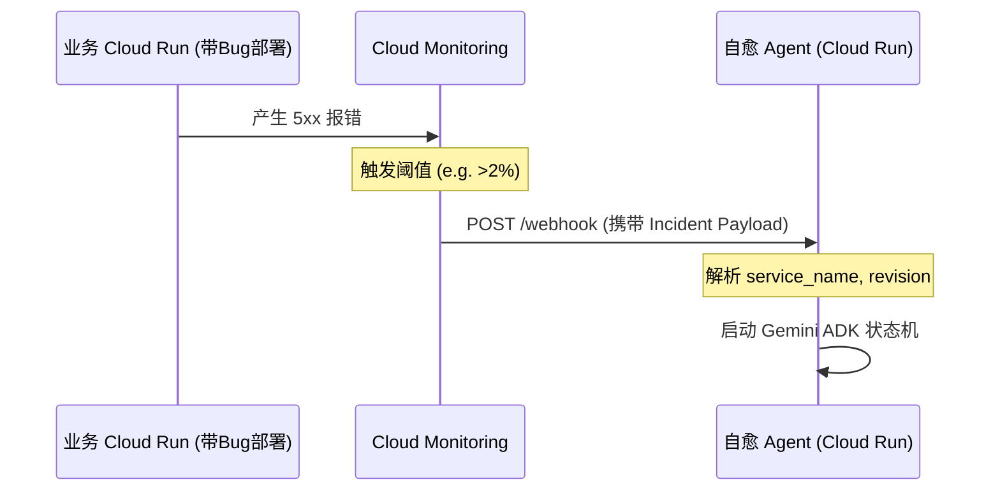
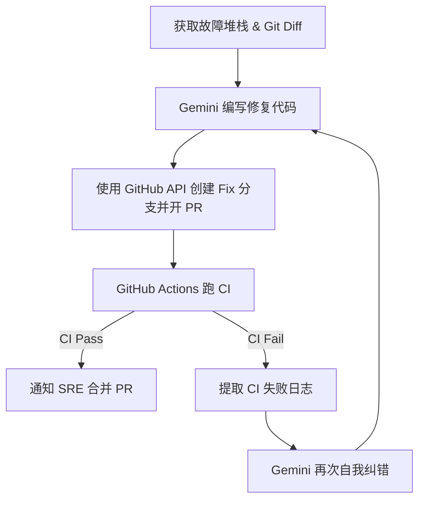

# 🚀 自治「发布/事故自愈」DevOps Agent 技术可行性与落地路径报告

*   **当前时间**：2026年6月28日
*   **提交截止时间**：2026年7月10日（剩余 12 天）
*   **核心路线**：极速交付、避坑第一、注重 GCP 评委看重的“实务价值”。

---

## 🛠️ Track A — 技术可行性 & 落地路径

### 1. ADK (Agent Development Kit) 最小骨架代码

#### 语言选型：**Python**
*   **首选原因**：Google Antigravity SDK (`google-antigravity`) 原生提供 Python SDK，对 Pydantic 的 `response_schema`（结构化输出）以及 `ToolContext`（状态共享）支持最完善。GCP 的 Vertex AI 与 Cloud SDK 在 Python 下拥有最成熟的客户端库，适合 12 天极速开发。

#### 状态机/Workflow 设计与最小骨架代码
利用 Google Antigravity SDK，我们采用 **Orchestrator-Worker 架构**。由主 Agent（Orchestrator）配合 `response_schema` 强制输出决策状态，通过 Python 外部循环或 Agent 内置 Tool Calling 来驱动状态机流转。

```python
import os
import pydantic
import asyncio
import logging
from typing import Literal, Optional, List
from google.antigravity import Agent, LocalAgentConfig, ToolContext, types

# 启用标准日志以观察 Agent 的思考链 (CoT)
logging.basicConfig(level=logging.INFO)

# ==========================================
# 1. 定义状态机决策的结构化输出 Schema
# ==========================================
class DevOpsDecision(pydantic.BaseModel):
    action: Literal["ROLLBACK", "CREATE_PR", "VERIFY", "COMPLETE", "ABORT"]
    target_revision: Optional[str] = None
    reasoning: str  # 必须写明思考理由，用于可视化思考链
    confidence: float

# ==========================================
# 2. 定义自治工具箱 (Tools)
# ==========================================
def get_cloud_run_revisions(service_name: str, ctx: ToolContext) -> str:
    """获取指定 Cloud Run 服务的 revision 列表、部署时间及流量占比。"""
    # 实际开发中在此处调用 google-cloud-run SDK
    # 可以通过 ctx.get_state/set_state 暂存历史状态
    return (
        "Revisions for service-prod:\n"
        "- rev-002: Active, 100% traffic, deployed 5m ago (Faulty)\n"
        "- rev-001: Inactive, 0% traffic, deployed 2h ago (Healthy)"
    )

def rollback_traffic(service_name: str, target_revision: str) -> str:
    """将 Cloud Run 服务的流量 100% 切换回指定的健康 revision。"""
    # 执行 gcloud / API 流量切换
    return f"Success: 100% traffic routed to {target_revision}."

def check_error_rate(service_name: str, duration_minutes: int) -> str:
    """查询 Cloud Monitoring 过去 N 分钟内该服务的 5xx 错误率。"""
    return "Current error rate: 0.00% (Last 5 minutes)"

# ==========================================
# 3. Agent 初始化与执行流程
# ==========================================
config = LocalAgentConfig(
    model="gemini-3.5-flash",  # 推荐默认模型，兼顾速度与 CoT 能力
    system_instructions=(
        "你是一个自治的「发布/事故自愈」DevOps Agent。\n"
        "你的目标是：1. 评估告警 -> 2. 回滚流量到健康 revision -> 3. 生成修复 PR -> 4. 验证错误率归零 -> 5. 恢复/完成闭环。\n"
        "你必须调用工具获取真实数据，并严格按照 response_schema 返回结构化决策。"
    ),
    tools=[get_cloud_run_revisions, rollback_traffic, check_error_rate],
    response_schema=DevOpsDecision,
    capabilities=types.CapabilitiesConfig(
        enable_subagents=True  # 允许主 Agent 派生 subagent 进行代码修复/PR 生成
    )
)

async def run_self_healing_workflow(service_name: str, alert_payload: str):
    async with Agent(config=config) as agent:
        prompt = f"服务 {service_name} 触发告警。告警上下文: {alert_payload}。请执行诊断与自愈决策。"
        
        # 1. 触发 Agent 思考与决策
        response = await agent.chat(prompt)
        
        # 2. 提取结构化输出
        decision_data = await response.structured_output()
        if not decision_data:
            print("Failed to parse structured output.")
            return
            
        decision = DevOpsDecision(**decision_data)
        print(f"[Decision] Action: {decision.action}, Target: {decision.target_revision}")
        print(f"[Reasoning] {decision.reasoning}")
        
        # 3. 驱动外部状态机
        if decision.action == "ROLLBACK" and decision.target_revision:
            # 驱动回滚工具并进入验证状态
            result = rollback_traffic(service_name, decision.target_revision)
            print(result)

# 启动入口
if __name__ == "__main__":
    asyncio.run(run_self_healing_workflow("service-prod", "Error rate exceeded 5% - Http 500 Spike"))
```

#### 部署与 Evaluation
*   **部署至 Cloud Run**：将 Python Agent 打包为 Docker 镜像，暴露 FastAPI 接口以接收 Webhook。配置 Cloud Run 允许未身份验证的调用（前端/监控 Webhook 触发），或使用 IAM 限制（推荐）。
*   **Evaluation 方案**：对于 DevOps 场景，离线 Eval 意义有限。应建立 **Sandbox CI 验证**：
    1. 编写集成测试脚本，模拟向 Git 提交“带 Bug 的代码”（例如引入 `/deploy-bomb` 接口）。
    2. 触发 Webhook，断言 Agent 是否在 3 分钟内执行了 `rollback_traffic` 且流量回到上个 Revision。

---

### 2. Cloud Run 流量秒级切换与故障定位

#### 确切命令
1.  **列出所有 Revision 历史**（按时间倒序，获取健康与非健康的版本号）：
    ```bash
    gcloud run revisions list \
      --service=PROD_SERVICE_NAME \
      --region=us-central1 \
      --limit=5 \
      --format="value(name,metadata.creationTimestamp,status.conditions[0].status)"
    ```
2.  **秒级切回上一个 Revision**（假设上一个健康版本是 `rev-healthy`）：
    ```bash
    gcloud run services update-traffic PROD_SERVICE_NAME \
      --region=us-central1 \
      --to-revisions=rev-healthy=100
    ```

#### Python API 接入 (google-cloud-run)
```python
from google.cloud import run_v2

def trigger_api_rollback(project_id: str, location: str, service_name: str, target_revision: str):
    client = run_v2.ServicesClient()
    name = f"projects/{project_id}/locations/{location}/services/{service_name}"
    
    # 构造流量配置，指定 100% 流量去往 target_revision
    traffic_target = run_v2.TrafficTarget(
        revision=target_revision,
        percent=100
    )
    
    service = run_v2.Service(
        name=name,
        traffic=[traffic_target]
    )
    
    request = run_v2.UpdateServiceRequest(service=service)
    operation = client.update_service(request=request)
    response = operation.result()
    return response.traffic
```

#### 如何定位“哪次 revision 引入故障”
1.  **比对部署窗口**：从告警 Webhook 拿到 `timestamp`，通过 API 匹配该时间点前后 5 分钟内新创建（活跃）的 `revision_name`。
2.  **差异日志分析 (Diff Analysis)**：
    *   通过 Cloud Logging API 提取故障 revision 的 `stderr` 堆栈信息。
    *   通过 Git API 获取故障 revision 对应的 Git Commit Hash 与前一个健康版本的 Commit Hash，进行代码级 `git diff`，直接投喂给 Gemini 找出 Bug 所在。

---

### 3. Gemini Structured Outputs & Controlled Generation

在 12 天快速开发中，**不要使用硬编码的正则表达式去解析 Gemini 的 Markdown 回复**。必须使用 `response_schema`（即 JSON Schema 模式）来强制模型进行可控生成（Controlled Generation）。

通过将 Pydantic 类直接传入 `LocalAgentConfig(response_schema=...)`：
1.  Gemini 会在后台生成对应的 JSON Schema，并通过 API 的 `responseSchema` 字段传递给 Vertex AI/Gemini 接口。
2.  模型输出将 100% 保证为合法的 JSON，且属性字段完全符合 Pydantic 定义。
3.  在代码中直接使用 `await response.structured_output()` 解析，可直接转化为 Python 字典或对象，消除状态机因“解析失败”而卡死或偏离轨道的可能性。

---

### 4. 监控验证：Cloud Monitoring & Logging API

#### 如何查询“错误率归零”
使用 **MQL (Monitoring Query Language)** 查询最近 5 分钟的错误率趋势。
```mql
fetch cloud_run_revision
| metric 'run.googleapis.com/request_count'
| filter (resource.service_name == 'PROD_SERVICE_NAME')
| align rate(1m)
| every 1m
| group_by [metric.response_code_class], sum(value.request_count)
```
或者，使用 **Cloud Logging API** 直接检索错误日志数。为了判断“归零”，Agent 应在回滚后发起轮询，检测最近 3 分钟内满足 `severity>=ERROR AND resource.labels.service_name="PROD_SERVICE_NAME"` 的日志条数是否降为 0。

#### 告警与 Webhook 配置
1.  **创建 Alerting Policy**：检测 5xx 响应占比超过 2% 持续 1 分钟。
    ```bash
    gcloud alpha monitoring policies create \
      --display-name="Cloud Run High Error Rate" \
      --conditions="..." \
      --notification-channels="NOTIFICATION_CHANNEL_ID"
    ```
2.  **配置 Webhook Notification Channel**：
    创建 Notification Channel，将 Endpoint 指向自愈 Agent 在 Cloud Run 上的服务地址（例如：`https://devops-agent-xxx.a.run.app/webhook`）。

---

### 5. Webhook 触发与接线设计



#### FastAPI Webhook 核心代码
```python
from fastapi import FastAPI, Request, BackgroundTasks

app = FastAPI()

@app.post("/webhook")
async def handle_alert(request: Request, background_tasks: BackgroundTasks):
    payload = await request.json()
    # 提取 GCP Alerting 结构化数据
    incident = payload.get("incident", {})
    service_name = incident.get("resource", {}).get("labels", {}).get("service_name")
    state = incident.get("state") # "open" or "closed"
    
    if state == "open" and service_name:
        # 异步启动自愈流，避免 Webhook 链接超时
        background_tasks.add_task(run_self_healing_workflow, service_name, str(payload))
        return {"status": "self-healing triggered"}
        
    return {"status": "ignored"}
```

---

### 6. 修复 PR + CI 自我纠错回路

自治修复不仅仅是回滚，还必须在 Git 仓库侧根治。



#### GitHub API 操作骨架 (使用 PyGithub)
```python
from github import Github

def create_github_pr(repo_name: str, branch_name: str, file_path: str, new_content: str, token: str):
    g = Github(token)
    repo = g.get_repo(repo_name)
    
    # 1. 获取主分支最新的 commit sha
    main_branch = repo.get_branch("main")
    
    # 2. 创建新分支
    repo.create_git_ref(ref=f"refs/heads/{branch_name}", sha=main_branch.commit.sha)
    
    # 3. 提交代码更改
    contents = repo.get_contents(file_path, ref=branch_name)
    repo.update_file(
        path=file_path,
        message="fix: auto-resolved deployment bomb",
        content=new_content,
        sha=contents.sha,
        branch=branch_name
    )
    
    # 4. 创建 Pull Request
    pr = repo.create_pull(
        title="[Auto Fix] Resolve Cloud Run Outage",
        body="This PR was generated automatically by DevOps Agent to fix the recent 5xx outage.",
        head=branch_name,
        base="main"
    )
    return pr.html_url
```

---

### 7. IAM 最小权限原则 (Least Privilege)

严禁在生产中使用 `Owner` 权限！为自愈 Agent 分配独立的 Service Account (SA)，并仅赋予以下角色：

| 资源层级 | 角色名称 | 对应权限 | 作用 |
| :--- | :--- | :--- | :--- |
| **Cloud Run** | Cloud Run Admin (`roles/run.admin`) | `run.services.update` | 切换流量、更新配置 |
| **Monitoring** | Monitoring Viewer (`roles/monitoring.viewer`) | `monitoring.timeSeries.list` | 查询 MQL/PromQL 指标 |
| **Logging** | Logs Viewer (`roles/logging.viewer`) | `logging.entries.list` | 读取错误日志堆栈进行诊断 |
| **Secret Manager** | Secret Manager Secret Accessor (`roles/secretmanager.secretAccessor`) | `secretmanager.versions.access` | 读取 GitHub Token 和 API Key |

*   **Secret Manager 管理**：GitHub Access Token 以及 Gemini API Key（如未使用 Vertex 凭据绑定）必须存储在 Secret Manager 中。Cloud Run 在启动时挂载这些 Secret 写入环境变量。

---

### 8. 已知坑点与最小可验证切片 (MVS)

#### ⚠️ 已知坑点 (实战痛点)
1.  **冷启动延迟与 Webhook 超时**：Cloud Run 的冷启动可能长达数秒。而 GCP Alerting Webhook 的超时时间非常严格。**解法**：Webhook 接口收到请求后立即返回 HTTP 202 响应，在后台启动异步线程（FastAPI `BackgroundTasks`）运行自愈 Agent。
2.  **Git 脑裂 (Split-Brain)**：当 Agent 正在修改代码开 PR 时，可能有人提交了新的主线代码。**解法**：Agent 提交前执行 `git pull --rebase`，或者 PR 依赖 GitHub 自带的冲突检测。
3.  **回滚抖动 (Flapping)**：如果回滚后指标没有立刻见效，Agent 可能会陷入重复回滚的死循环。**解法**：在 `ToolContext` 中记录 `cooldown`（冷却期），同一个服务执行回滚后 10 分钟内禁止二次回滚。

#### 🚀 2周内最稳技术栈选型结论
*   **开发语言**：Python 3.11 + FastAPI
*   **Agent SDK**：Google Antigravity SDK
*   **大模型**：`gemini-3.5-flash`（因其处理 Token 速度快，逻辑足够应对分支切分与调用 API）
*   **部署环境**：Cloud Run
*   **触发源**：GCP Cloud Monitoring Alerting Policy
*   **控制台交互**：FastAPI + Streamlit（用于可视化 Agent 思考链）

#### 📅 极速两周开发路线图 (12天)

```
[Day 1-3: MVS 验证]       [Day 4-7: 接入自愈]         [Day 8-10: 闭环与UI]      [Day 11-12: Demo准备]
编写故障服务(延时炸弹)  ---> 实现 Revision 流量切换 ---> 跑通 CI/CD 纠错回路 ---> 录制 Demo 视频
接入 Webhook 触发          写死 MQL 查询             Streamlit 思考链展示       准备 GCP 评委文档
```

---

## 📈 Track B — 用户 & 市场验证

### 1. ICP (目标用户) 精确画像
我们**不**把中大型 SRE 团队作为初期主要 ICP。他们的发布流程极其严格，不会允许一个外部 AI 随意修改线上流量和自动合 PR。

*   **核心 ICP**：**使用 GCP Cloud Run 的中小规模团队、独立开发者或初创企业**。
    *   **痛点**：没有专职 SRE，开发人员晚上不想值班。一旦发布引入 Bug，排查加上手动回滚会造成长时间的服务中断（高 MTTR）。
    *   **最痛场景**：**部署窗口外的“延迟炸弹”**。例如：下午 6 点部署，晚上 10 点流量上升后，因连接池泄露导致服务彻底崩溃。此时开发人员正在休息，Agent 可以无人值守快速回滚至健康版本止血。

### 2. 真实需求强度与付费意愿分析

| 竞品名称 | 定位 | 定价模式 | 我们与它的差异点 |
| :--- | :--- | :--- | :--- |
| **Resolve.ai** | 自治 SRE Agent | 订阅制 / 按 Agent 工作时长收费 | 我们主打 **GCP 深度整合**与 **Cloud Run 极低成本接入**。 |
| **incident.io** | 故障流转协同工具 | 按席位收费 | 他们是“协同/发通知”，我们是“直接用 AI 执行流量回滚并提修复 PR（自治行动）”。 |
| **PagerDuty** | 警报轮班与排班管理 | 按席位/使用量收费 | 纯警报流转，无法直接修复代码和安全回滚。 |
| **Sedai.io** | 自动扩缩容与自愈 | 按云资源消耗比例收费 | 偏底层运维指标优化，不具备 Gemini 提供的“自动分析报错并提交代码 PR”的逻辑理解力。 |

*   **付费意愿**：小团队愿意为“晚上睡个好觉”支付 **$49 - $99/月** 的保费。

### 3. AI SRE 市场趋势
当前，可观测性市场（DataDog, Dynatrace）已经完全成熟，市场正在从“只监控、不行动 (Read-only)”演进为“自治闭环 (Read-Write)”。
*   传统的 AIOps 仅能做到“异常检测”。
*   基于 LLM 的 **DevOps Agent** 具备了调用云端 API、理解代码 Diff、分析 Stack Trace 的能力，使得“自动回滚 + 自动提 PR”的自愈闭环首次在技术上可行。

### 4. 「とどける/实务」叙事：非 Demo 证明
如何证明我们不是在做一个花哨的 Demo，而是能真正落地的实务产品？
1.  **灰度切分而非盲目回滚**：实务中，Agent 不会一有报警就 100% 切回旧版本。我们将展示 Agent 执行“先切 10% 流量到旧版本，验证 2 分钟，无报错后再切 100%”的灰度逻辑。
2.  **Git 作为单一信任源 (GitOps)**：临时回滚只是为了线上止血，代码仓库依然要保持一致。Agent 会立刻提交 Fix PR。如果 SRE 同意，PR 合并后发布最新版本，流量自动重新指回最新 Revision。这种不破坏现有 CI/CD 规范的设计是实务中唯一能被接受的方式。
3.  **完善的 Auditing（审计日志）**：所有的决策依据（如 MQL 报错曲线、Git Diff 片段、Gemini 思考过程）均记录在 Streamlit 仪表盘上，方便人类随时审计。

### 5. 对评委（GCP 评委）的价值传递与打分点
GCP 评委最关心两点：**Gemini 能力的极限发挥** 以及 **GCP 核心组件（Cloud Run, Monitoring, Logging）的生态粘性**。

*   **实务价值展示方案**：
    *   **一键安装体验**：评委只需给他们的 GCP Service Account 绑定我们提供的最小 IAM 角色，即可在一分钟内为任意 Cloud Run 开启“自愈外挂”。
    *   **GCP 原生优势**：展示通过 Cloud Run Traffic Splitting 配合 Google Monitoring MQL 实现的秒级回滚。这证明了我们的方案比部署在 AWS ECS/Kubernetes 上的自愈系统轻量数倍，是对 Cloud Run 核心卖点的绝佳广告。
    *   **可视化说服力**：在 Demo 视频中，使用左右分屏：左边是业务代码抛出 500 异常，右边是 Agent 的 Streamlit 界面显示“检测到告警 -> 提取日志 -> 流量切回 rev-100（500 瞬间归零）-> 自动提交修复 PR”。这种强烈的视觉对比对评委最具冲击力。
